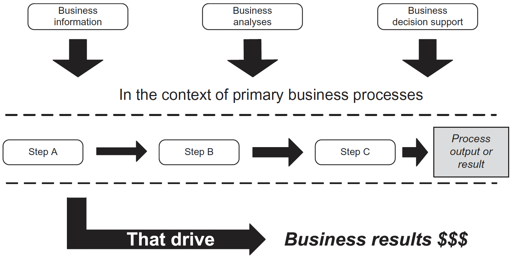
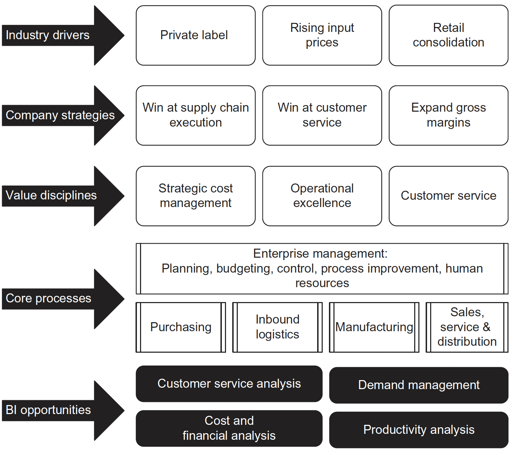

```{r setup, include = FALSE}
# libraries --------------------------------------------------------------------
library(tidyverse)
library(knitr)
library(anicon)
library(nomnoml)
library(DiagrammeR)
# general options --------------------------------------------------------------
options(scipen = 999)
set.seed(42)
# chunk options ----------------------------------------------------------------
opts_chunk$set(
  cache.extra = rand_seed, 
  message = FALSE, 
  warning = FALSE, 
  error = FALSE, 
  echo = FALSE,
  cache = FALSE,
  comment = "", 
  fig.align = "center", 
  fig.retina = 3
  )
```

# Module Contact Details
.pull-left[
## Damien Dupré, PhD

- email: damien.dupre@dcu.ie
- phone: 00353 (0)1 700 6360
- office: Q233 DCU Business School

]

.pull-right[
```{r out.width='60%'}
include_graphics("https://pbs.twimg.com/profile_images/1221820283159490565/96a3XnSg_400x400.jpg")
```
]

---

# About Me

#### Developement of the DynEmo Facial Expression Database (Master)

* Dynamic and spontaneous emotions
* Assessed with self-reports and by observers

#### Analysis of Emotional User Experience of Innovative Tech. (Industrial PhD)

* Understand users' acceptance of technologies from their emotional response
* Based on multivariate self-reports

#### Evaluation of Emotions from Facial and Physiological Measures (Industrial PostDoc)

* Applications to marketing, sports and automotive industries
* Dynamic changes with trend extraction techniques (2 patents)

#### Performance Prediction using Machine Learning (Academic PostDoc)

* Application to sport analytics
* Big Data treatment (> 1 million users with activities recorded in the past 5 years)

---

# Module Content

## Knowledge

- Data Organisation
- Data Analytics Pipeline
- Data Cleaning
- Professional Visualisation Outputs
- Academic Statistical Analyses
- First Steps in Programming Languages

## Skills

- SQL
- EXCEL
- PowerBI
- TABLEAU
- R & RStudio

The lecture will alternate between **theory sessions**, **practice sessions** and **exercises**.

---

# Module Content

## Targets

- **Short Term**: Success in MT5000 assignments

- **Mid Term**: Success in all other DCU lectures (academic data analytics style and conventions)

- **Long Term**: Professional data analytic expertise (CV optimised with essential data analytics skills)

## Professional Requirements

`r faa("bomb", animate="burst", speed="slow", color="blue")` Data Analytics is the best, easiest and highly paid job you can obtain with your master, see by yourself:
- [MSc Management Business – Deep Dive with Cathal Dunne, AIB, Data Quality Analyst](https://business.dcu.ie/msc-management-business-deep-dive-with-cathal-dunne-aib-data-quality-analyst/)
- [Data Analyst Positions on Indeed.com](https://ie.indeed.com/jobs?q="data analyst"&l=Dublin%2C County Dublin)

---

# Module Organisation

### Lecture Every Week
- Wednesday between 11am and 1pm (Irish Time) 
- Until March 30th, 2022
- Recordings available on Loop

### Tutorial, Exercise and Answer Videos Every Week
- Practice with the technologies and methods shown during the lectures
- Essential for the assignments

### Optional but Strongly Adviced Online Trainings
- Free and Short Courses Online (Kubicle, Udemy + other learning platforms)

---

# Assessment Structure

- 100% CA with 2 Assignments

- A unique dataset will be send to you by email to prevent plagiarism. This dataset will be used for each assignment:

### Assignment 1. Tableau Dashboard (50%)

> Deadline 23/03/2022

> Design a professional looking data dashboard aiming to communicate a narrative (also called storytelling)

### Assignment 2. Rmarkdown Dashboard (50%)

> Deadline 13/04/2022 (`r faa("exclamation-triangle", animate="flash", speed="slow", color="red")` Only 3 weeks after Assignment 1)

> Using R and RStudio, reproduce the results presented in the tableau dashboard with a Rmarkdown Dashboard

---

# Assessment Structure

### `r faa("exclamation-triangle", animate="flash", speed="slow", color="red")` Warning

- Each assignment's instruction will be uploaded on loop after the deadline of the previous assignment.
- Please submit professional outputs, as I'm not expecting student's approximative work from you any more.
- Please avoid any form of plagiarism, copy-pasting or group collaborations. I will easily spot rephrased sentences, similar figure design and code sharing.

---
class: inverse, mline, center, middle

# Data Analytics and Big Data

---

# What are Big Data?

### Definition

The term Big Data corresponds to a table containing observations (i.e. database or dataset) that is **too long, too large or too complex to be handled by conventional tools**

### Microsoft Excel's Limits (v16.44 - Office 365):

- Total number of rows: **1,048,576 rows**
- Total number columns: **16,384 columns**

.pull-left[
```{r out.width='60%'}
include_graphics("https://qph.fs.quoracdn.net/main-qimg-e4072574da0c7a785bc4b138b694189f")
```
]
.pull-right[
*Have you ever tried to scroll down to the end of Excel? Because I did!*
]

---

# Data vs. Information

Without data, an organization could not successfully complete most business activities. However, organisations need to convert these data into meaningful information

- Data consists of raw facts
- Information is often confused with the term data

### Example: Sales Manager
- Knowing number of sales for each representative (fact – data)
- Knowing total monthly sales (transformed – information)

```{nomnoml, fig.width=12, fig.height=3}
#stroke: black
#direction: right
#align: center
[Data]->[Transformation Process]
[Transformation Process]->[Information]
```

---

# Value of Information

- **Goals**: Helps decision makers achieve organisational goals
- **Performance**: Valuable information helps people and organisations perform
- **Accuracy**: Inaccurate/Incomplete information leads to Poor Decisions and can result in High Cost for the organisation 

--

### Data Analytics

- The science of using data to build models that lead to better decisions that in turn add value to individuals, companies and institutions
- The analysis of data, typically large sets of data, by the use of mathematics, statistics, and computer software

```{r}
#| fig.cap: "Data analytics provides an integrated view of business performance."
DiagrammeR::grViz("
  digraph {
    'Business performance results' -> 'What happened?' [dir = both]
    'Business performance results' -> 'Why did it happen?' [dir = both]
    'Business performance results' -> 'What do we want to happen?' [dir = both]
  }", width = 800, height = 150)
```

---

# Data Analytics in Organisations

```{r out.width='60%'}
#| fig.cap: "Overview of Data Analytics in Organisations"
include_graphics("img/organisation_structure.jpg")
```
.center.tiny[Laursen and Thorlund (2017) Business Analytics for Managers [`r emo::ji("link")`](https://capitadiscovery.co.uk/dcu/items/dda-27/EBC4714241?query=Business+Analytics+for+Managers&resultsUri=items%3Fquery%3DBusiness%2BAnalytics%2Bfor%2BManagers)]

---

# Competitive Advantages

```{r out.width='60%'}
#| fig.cap: "An investment in data analytics needs to increase profits if it is to generate a return on investment"

```
.center.tiny[Williams (2016) Business Intelligence Strategy and Big Data Analytics [`r emo::ji("link")`](https://capitadiscovery.co.uk/dcu/items/1021702?query=Business+Intelligence+Strategy+and+Big+Data+Analytics&resultsUri=items%3Fquery%3DBusiness%2BIntelligence%2BStrategy%2Band%2BBig%2BData%2BAnalytics)]

Whether the goal is improved enhanced customer service, reduced operating costs, or any other improvement initiative; success demands:
- A very skilful general management and change management
- A clear vision of the desired future state
- A compelling strategic argument for achieving the future state

---

# Strategic Importance of Data Analytics

Over the past 20 years, Data Analytics has proven to be highly useful in improving many different business processes:

- **Management processes:** e.g., strategic planning, budgeting, performance measurement, controlling, and performance variance analysis.

- **Revenue generation processes:** e.g., market research, customer segmentation, sales planning, revenue budgeting and management,
pricing, promotions planning and execution, product development, service development, customer order processing, and so forth.

- **Operating processes:** e.g., purchasing, supplier management, inbound logistics, manufacturing, operations, inventory management, distribution centre management, outbound logistics, quality assurance, order fulfilment, customer service, and so forth.

A well-designed BI environment serves as a powerful multifaceted tool for performance measurement and process improvement.

---

# Strategic Importance of Data Analytics

```{r out.width='60%'}
#| fig.cap: "Opportunities to leverage Data Analytics within the core processes that drive business results."

```
.center.tiny[Williams (2016) Business Intelligence Strategy and Big Data Analytics [`r emo::ji("link")`](https://capitadiscovery.co.uk/dcu/items/1021702?query=Business+Intelligence+Strategy+and+Big+Data+Analytics&resultsUri=items%3Fquery%3DBusiness%2BIntelligence%2BStrategy%2Band%2BBig%2BData%2BAnalytics)]

---

# Styles of Data Analytics

It uses a combination of historical information about past transactions or events and reference data about, for example, customers or products, to enable a wide variety of analyses and decision support techniques.

- **Standard Reports:** Preformatted information for predefined backward-looking analysis. 

- **Academic Reports:** Application of research methods to business information  using descriptive and inferential statistics.

- **Dashboards:** Business performance metrics using specific variables presented in a tabular or graphical format.

- **Alerts:** Communication to designated business people when a key business variable is outside a predefined performance standard or range.

- **Predictive Analytics:** Application of historical business information to predict future the performance and potentially prescribe a favoured course of action.

---

# Data Analytics Workflow

```{r out.width='80%'}
include_graphics("https://d33wubrfki0l68.cloudfront.net/571b056757d68e6df81a3e3853f54d3c76ad6efc/32d37/diagrams/data-science.png")
```

### Techniques and tools used in this module

- **Step 1**: Import Data with SQL
- **Step 2**: Tidy and Transform Data with MS Excel
- **Step 3**: Visualise, Model and Communicate your Results with PowerBI and Tableau 

**And finally, do all these steps again only with R**

---
class: inverse, mline, left, middle


# Thanks for your attention and don't hesitate to ask if you have any question!

[`r fontawesome::fa(name = "twitter")` @damien_dupre](http://twitter.com/damien_dupre)  
[`r fontawesome::fa(name = "github")` @damien-dupre](http://github.com/damien-dupre)  
[`r fontawesome::fa(name = "link")` damien-datasci-blog.netlify.app](https://damien-datasci-blog.netlify.app)  
[`r fontawesome::fa(name = "paper-plane")` damien.dupre@dcu.ie](mailto:damien.dupre@dcu.ie)
