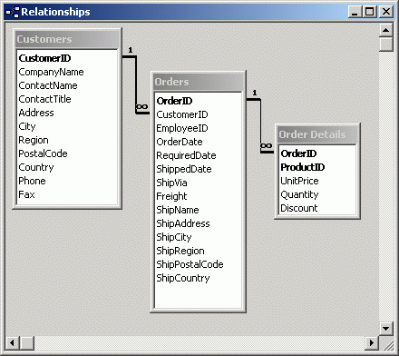
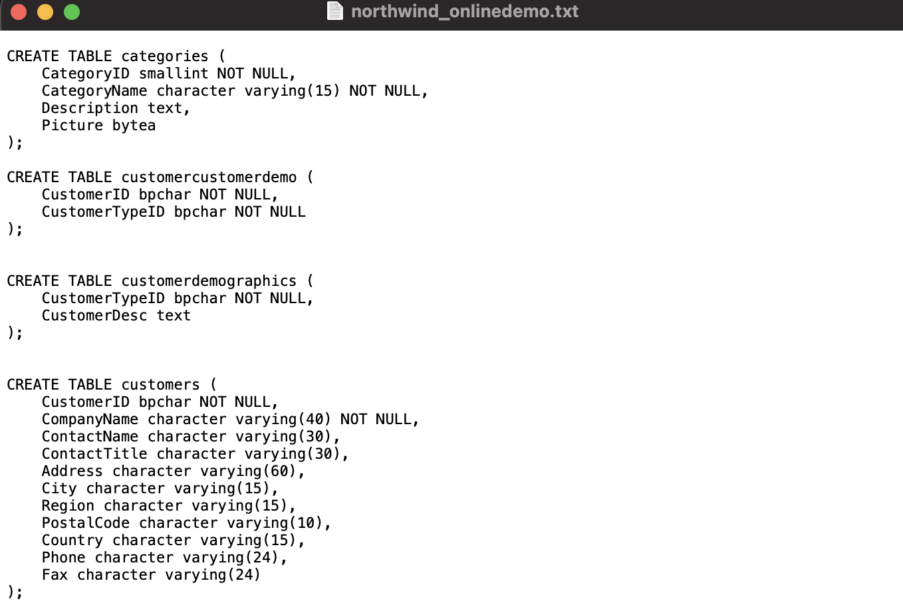
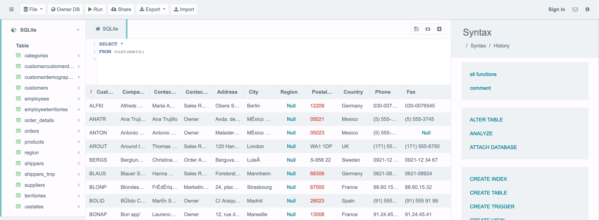

```{r setup, include = FALSE}
# libraries --------------------------------------------------------------------
library(tidyverse)
library(knitr)
library(countdown)
library(anicon)
# general options --------------------------------------------------------------
options(scipen = 999)
options(htmltools.preserve.raw = FALSE)
set.seed(42)
# chunk options ----------------------------------------------------------------
opts_chunk$set(
  cache.extra = rand_seed, 
  message = FALSE, 
  warning = FALSE, 
  error = FALSE, 
  echo = FALSE,
  cache = FALSE,
  comment = "", 
  fig.align = "center", 
  fig.retina = 3
  )
```

class: inverse, mline, center, middle

# 1. Data Storage

---

# The Hierarchy of Data

```{r out.width='80%'}
include_graphics("https://squagoals.weebly.com/uploads/5/7/5/6/57565411/5440736.jpg?325")
```

---

# Database Access

### When building a database, organizations must consider

- **Content**: What data should be collected and at what cost?
- **Access**: What data should be provided to which users and when?
- **Logical** structure: How should data be arranged so that it makes sense to a given user

### To allow multiple simultaneous access to the database

- Hosted on a remote “cloud” server (usually)
- Database client manager including Host Address (IP or URL) and Guest Access (TCP Port and Login/password)

As previously mentioned, databases can contain a huge amount of data and tables can contains billions of observations. Therefore, **the aim of accessing a database is to subset a table to obtain only the relevant data by querying the database**. Then, the data obtained can be processed by another tool

---

# Relational Database

.pull-left[

Observations are related between tables using a shared **key variable**

### Example

Table Customers and table Orders contain the same CustomerID variable
Table Orders and table Order Details contain the same OrderID variable
]

.pull-right[
```{r out.width='100%'}

```
]

---

# Relational Database

```{r out.width='90%'}
include_graphics("https://www.databasejournal.com/img/2010/08/04fig09.jpg")
```

.center[Structure, also called schema, of the Northwind Company database]

---

# Database Schema

The database structure, or schema, describes:

- All tables and all variables
- Relationship between tables

The schema is crucial to enabling retrieval of desired data. Therefore the structure of the database must be understood for accurate querying. A wrong understanding  of its structure can lead to wrong results.

```{r out.width='50%'}
include_graphics("https://external-preview.redd.it/eWJ9RiTdWLJAyW8R7AuX0HGijt10i9SpSEXL55Iy_Uw.jpg?auto=webp&s=6ccfe1cf8e0d2827d8809c3823a332c3c7b26074")
```

---
class: inverse, mline, center, middle

# 2. Data Access

---

# Database Queries

Database can be made of millions/billions data spread on hundreds of tables/files

A Query is a set of instructions to retrieve, sort and format returning data

- Extracting information out of the database to process them (e.g., with MS Excel)
- E.g., “find me all customers in my database”

Structured Query Language (SQL) is the language to query a database and to obtain one file with the information you need only

This is the main SQL statement you need to understand for querying:

```{sql, eval=FALSE, echo=TRUE}
SELECT *
FROM table_name;
```

Translation: **Show me the data from all the variables in the table 'table_name'**

---

# Basic Syntax of SQL Query

1. Always starts with SELECT followed by * (all variables) or by the variables to select

2. Always indicates FROM after SELECT followed by the table name

3. Always finishes with a Semicolon

---

# Basic Syntax of SQL Query

```{sql, eval=FALSE, echo=TRUE}
SELECT variable_1, variable_2
FROM table_name;
```

Translation: 
- **Show me the data only from the variables 'variable_1' and 'variable_2' ...**
- **... in the table 'table_name'**

Example when querying the Northwind database:

```{sql, eval=FALSE, echo=TRUE}
SELECT ProductID, ProductName
FROM Products;
```

Translation: 
- **Show me the data only from the variables 'ProductID' and 'ProductName' ...**
- **... in the table 'Products'**

---

# Filter a table with SQL

The statement WHERE indicates which observation to keep

It is a logical statement:
- All conditions that are FALSE are discarded
- All conditions that are TRUE are kept

Example when querying the Northwind database:

```{sql, eval=FALSE, echo=TRUE}
SELECT ProductID, ProductName
FROM Products
WHERE ProductName = 'macbook';
```

Translation: 
- **Show me the data only from the variables 'ProductID' and 'ProductName' ...**  
- **... in the table 'Products' ... **  
- **... but only if the product is a macbook**

---

# More Possibilities with SQL

More functions can be added, such as:

- DISTINCT: keep unique observations only
- GROUP BY: aggregate data for similar observations
- HAVING: condition with mathematical calculation
- ORDER BY: sort observations
- LIMIT: keep only a certain amount of observations
- ...

```{r out.width='100%'}
include_graphics("img/sql_order.png")
```

Words of Caution: Easy to build queries that retrieve nonsense, never complete, or end up completely bogging down the database. Understanding Schema is a way to prevent that

---

# Convert Data to Information

When the relevant data have been subset from a database, it is possible to save them in a smaller spreadsheet file to be processed in other software

Possible file format to save data from queries:

```{r}
tribble(
  ~Format, ~Usecase, ~Reason,
  ".json", "Only for computer engineers/developers", "JavaScript Object Notation (https://www.json.org/), semi-structured data file",
  ".csv", "Must be the default", "Comma Separated Value is the most common data format. Open and light",
  ".xls or .xlsx", "Never", "MS Excel format (not open-source) which contains interface, metadata and figures. To avoid"
  ) %>% 
  kable()
```

However, in organisations it is usual to use data that are directly stored in MS Excel files:

- Local only (except if stored in an online "cloud" repository)
- No update possible if stored locally
- Can be very messy and unstructured

---
class: inverse, mline, center, middle

# 3. SQL Tutorial

---

# Objectives

All the game of this tutorial will be to create new tables that can be downloaded for our analyses.

With this tutorial, test basic SQL queries and explore additional functions

```{r out.width='80%'}

```

---
class: title-slide, middle

## Step 1. Configure the Database

---

# Configure the Database (1)

#### On the loop page of the module, download the document called “northwind_onlinedemo.txt” on your desktop.

```{r out.width='100%'}

```

---

# Configure the Database (2)

#### Open your web browser and go to https://sqliteonline.com/

```{r out.width='100%'}
include_graphics("img/tut_1_1.png")
```

---

# Configure the Database (3)

#### Click right (Win)/double (Mac) on demo, use DROP

```{r out.width='70%'}
include_graphics("img/tut_1_2.png")
```

---

# Configure the Database (3)

```{r out.width='50%'}
include_graphics("img/tut_1_3.png")
```

```{r out.width='100%'}
include_graphics("img/tut_1_4.png")
```

---

# Configure the Database (4)

#### Copy-Paste the text of the file “northwind_onlinedemo.txt” (3556 lines) and press Run on the top menu bar (you should see the 15 table appears on the left box).

```{r out.width='100%'}
include_graphics("img/tut_1_5.png")
```

---

# Configure the Database (5)

#### Select all the lines in the box (CTRL + A or Cmd + A) and delete them. 

The first line should be empty as displayed here below.

```{r out.width='100%'}
include_graphics("img/tut_1_6.png")
```

---
class: title-slide, middle

## Live Demo

---
class: title-slide, middle

## Step 2: Test some Basic Queries

---

# Run the Following Query (1)

Copy the two lines here bellow and paste them in the code box. Click RUN to process the code:

```{sql, eval=FALSE, echo=TRUE}
SELECT *
FROM customers;
```

You should obtain:
- **Give me the data of all the variable ...**
- **... from the table called "customers"**

```{r out.width='100%'}

```

---

# Run the Following Query (2)

Copy the two lines here bellow and paste them in the code box. Click RUN to process the code:

```{sql, eval=FALSE, echo=TRUE}
SELECT *
FROM customers
WHERE Country = "Mexico" OR Country = "Ireland";
```

Verify that you obtained:
- **Give me the data of all the variable ...**
- **... from the table called "customers"...**
- **... but only for customers which country is Mexico or Ireland**

---
class: title-slide, middle

## Step 3: Explore New Functions

---

# Create New Variables

While asking for a subset of the database with a SQL query, it is also possible to perform basic operations and to display their results in new variables

Instead of using a variable name, indicate the calculation for each observation and give it a variable name with **AS**

For example, RUN the following code:

```{sql, eval=FALSE, echo=TRUE}
SELECT ProductName, UnitsInStock * UnitPrice AS profit_max
FROM products;
```

Verify that you obtained:
- **Give me the data of ProductName and of UnitsInStock multiplied by UnitPrice which is now called profit_max ...**
- **... from the table called "products"**

---

# Summarise Data

A new variable could also includes a summary/aggregation of data

Several functions like COUNT, AVG, MAX, or MIN can be used in addition to GROUP 

For example, RUN the following code:

```{sql, eval=FALSE, echo=TRUE}
SELECT  COUNT (ContactName) AS count_contact, Country
FROM customers
GROUP BY Country;
```

Verify that you obtained:
- **Give me the data of a variable count_contact which counts the amount of contact and also their country ...**
- **... from the table called "customers"...**
- **... and count the amount of contact by country**

---

# Join Tables

Sometimes the information you need is spread accross two tables. Then, it is necessary to query the two tables in the same time.

JOIN allows to merge two table ON a key variable (included in both table)

5 different type of JOIN exists:
- LEFT keeps only the data from the first table
- RIGHT keeps only the data from the second table
- FULL keeps all the data from both first and second table
- INNER keeps only common data to both first and second table
- ANTI keeps data that are not common to both first and second table

For example, RUN the following code:

```{sql, eval=FALSE, echo=TRUE}
SELECT *
FROM  orders 
INNER JOIN customers ON orders.CustomerID =  customers.CustomerID;
```

---
class: title-slide, middle

## Step 4: Write Your Own Queries

---

# Translate to SQL Queries 

Query 1:
- **Give me the product names and prices ...**
- **... from the table products ...**
- **... but only for products which price is higher than $60 and lower than $120**

Query 2:
- **Give me the average price ...**
- **... from the table products ...**
- **... for each category of products**

Query 3:
- **Give me the cities ...**
- **... from the table customers ...**
- **... but only located in Ireland**

```{r}
countdown(minutes = 15, warn_when = 60)
```

---

# Solutions

Query 1:

.pull-left[
```{sql, eval=FALSE, echo=TRUE}
SELECT ProductName, UnitPrice
FROM products
WHERE UnitPrice > 60 AND UnitPrice < 120;
```
]

.pull-right[
```{sql, eval=FALSE, echo=TRUE}
SELECT ProductName, UnitPrice
FROM products
WHERE UnitPrice BETWEEN 60 AND 120;
```
]


Query 2:
```{sql, eval=FALSE, echo=TRUE}
SELECT CategoryID, AVG(UnitPrice) AS average_price
FROM products
GROUP BY CategoryID;
```

Query 3:
```{sql, eval=FALSE, echo=TRUE}
SELECT City
FROM customers
WHERE Country = 'Ireland';
```

---

# What's Next?

- `r faa("star", animate="burst", speed="slow", color="orange")` Challenge yourself with SQL exercises on Loop

- `r faa("star", animate="burst", speed="slow", color="orange")` SQL is not part of any assignment for the module but is essential to add to your CV. Improve your knowledge with the following free online training: https://www.udemy.com/course/introduction-to-databases-and-sql-querying/

```{r out.width='50%'}

```

---
class: inverse, mline, left, middle


# Thanks for your attention and don't hesitate to ask if you have any question!

[`r fontawesome::fa(name = "twitter")` @damien_dupre](http://twitter.com/damien_dupre)  
[`r fontawesome::fa(name = "github")` @damien-dupre](http://github.com/damien-dupre)  
[`r fontawesome::fa(name = "link")` damien-datasci-blog.netlify.app](https://damien-datasci-blog.netlify.app)  
[`r fontawesome::fa(name = "paper-plane")` damien.dupre@dcu.ie](mailto:damien.dupre@dcu.ie)
