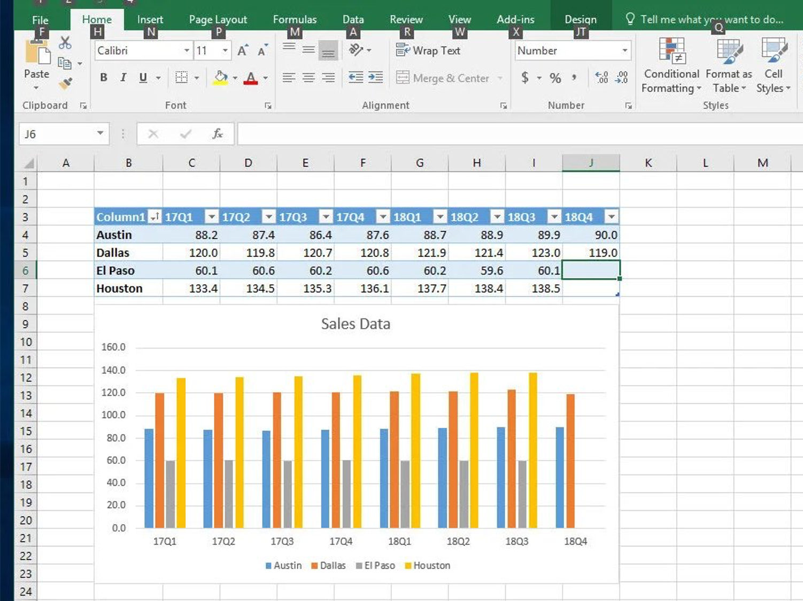
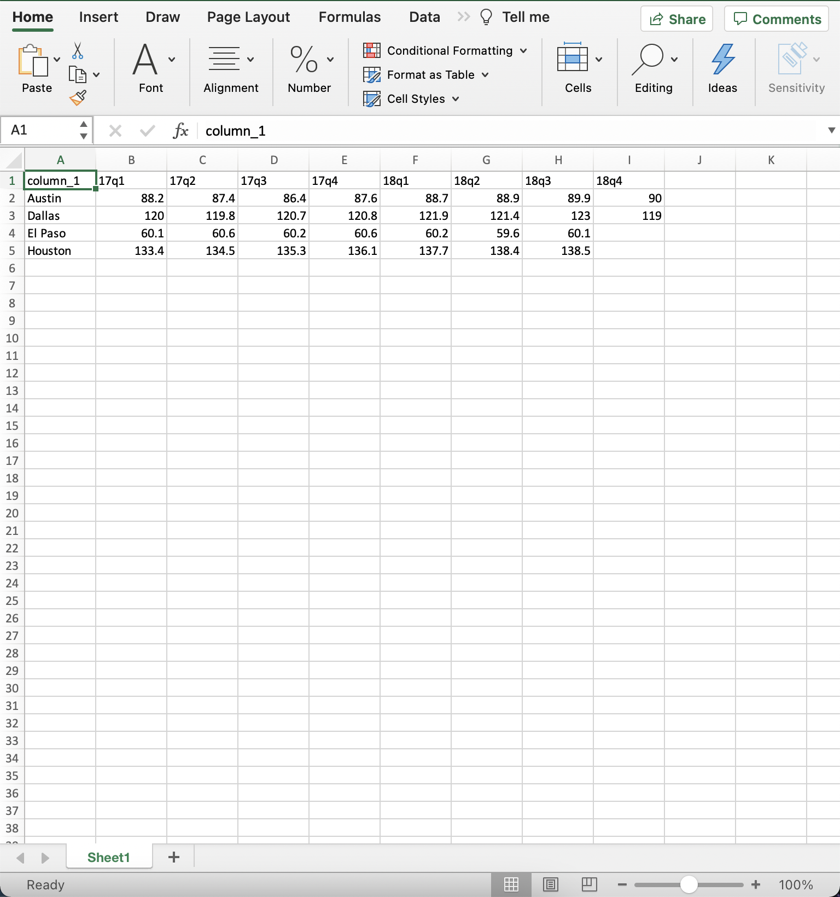
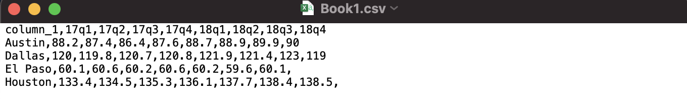
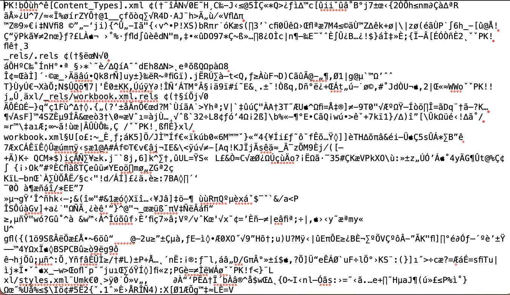
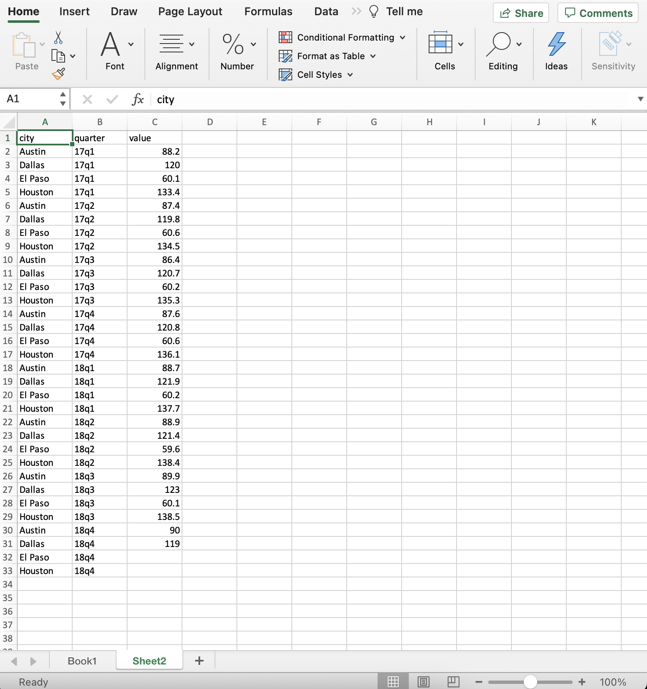

```{r setup, include = FALSE}
# general options --------------------------------------------------------------
options(scipen = 999)
set.seed(42)
# chunk options ----------------------------------------------------------------
knitr::opts_chunk$set(
  cache.extra = knitr::rand_seed, 
  message = FALSE, 
  warning = FALSE, 
  error = FALSE, 
  echo = FALSE,
  cache = FALSE,
  comment = "", 
  fig.align = "center", 
  fig.retina = 3
  )
# libraries --------------------------------------------------------------------
library(tidyverse)
library(knitr)
library(tweetrmd)


```

# The Real Data Analytics

90% of Data Analytics job is about cleaning and transforming data:
- Essential to know the key principles
- Essential to do it quickly

No need if data are extracted from a database but in general people are using MS Excel to modify and store data. Therefore, a first requirement for a data analyst is to excel in Excel!

```{r out.width='50%'}
include_graphics("https://img.devrant.com/devrant/rant/r_1379286_fd7KD.jpg")
```

---
class: inverse, mline, center, middle

# 1. Data Cleaning

---

# Data Cleaning

```{r out.width='100%'}
include_graphics("https://raw.githubusercontent.com/allisonhorst/stats-illustrations/master/rstats-artwork/tidydata_2.jpg")
```

---

# Question from Kareem

```{r out.width='70%'}
tweetrmd::tweet_screenshot(
  tweetrmd::tweet_url("kareem_carr", "1319416806633779201"),
  maxwidth = 300,
  hide_media = FALSE,
  theme = "dark"
  )
```

---

# Question from Kareem

#### Honestly, tell me in the chat what is going wrong with this spreadsheet? 

```{r out.width='70%'}

```

Help: There are 4 major problems

---

# Question from Kareem

```{r out.width='60%'}
tweetrmd::tweet_screenshot(
  tweetrmd::tweet_url("datascimichael", "1319584118343147522"),
  maxwidth = 300,
  hide_media = FALSE,
  hide_thread = TRUE,
  theme = "dark"
  )
```

---

# What It Should Look Like

.pull-left[
```{r out.width='100%'}

```
]
.pull-right[
- No Chart
- No Formatting (removed with csv)
- Starts Column A
- Starts Row 1
]

---

# Comma Separated Value

Among the many different data formats, csv (for Comma Separated Value) is the most natural: 
- open-source format
- light file

It can be opened with any text editor, and looks as follow:

```{r out.width='100%'}

```

At the contrary if you open an xlsx file with a text editor, here is what you obtain:

```{r out.width='100%'}

```

---

# Table Organisation

There are two type of organisations for a table:

- **Wide Format**: A column per measure of the same object
- **Long Format**: One column for measures of the same type, objects can be repeated

Kareem's table is in the Wide Format (measure for each city spread on multiple columns)

```{r out.width='100%'}

```

---

# Table Organisation

Kareem's table could be also used in a Long Format (only one column for all data)

```{r out.width='100%'}

```

---

# Table Organisation

In general prefer the **Long Format** also called Tidy Data:

- Each variable has its own column 
- Each observation is placed in its own row 
- Each value is placed in its own cell

```{r out.width='100%'}
knitr::include_graphics("https://r4ds.had.co.nz/images/tidy-1.png")
```

Note: Don't be afraid of duplicating certain information

---

# Table Organisation

```{r out.width='100%'}
knitr::include_graphics("https://raw.githubusercontent.com/allisonhorst/stats-illustrations/master/rstats-artwork/tidydata_1.jpg")
```

---

# Table Organisation

The action of converting from Wide to Long (or from Long to Wide) is called Pivot

```{r out.width='100%'}
knitr::include_graphics("https://garrettgman.github.io/images/tidy-9.png")
```

```{r out.width='30%'}
knitr::include_graphics("https://edible-alpha.org/wp-content/uploads/2018/06/Pivot.jpg")
```

---

# Use a Name Convention

When cleaning data tables, **you need to remove all spaces between words in your headers** because spaces are not processed by most of Data Analytics Software.

.pull-left[
My suggestion is **snake_case**: all small letter and words separated by "_"

For example, a header "Population Country" will become "population_country"

It is also strongly advised to use a name convention for all file names as well. "Assignment MT5000.doc" becomes "assignment_mt5000.doc"
]

.pull-right[
```{r out.width = "100%"}
knitr::include_graphics("img/name_convention.jpg")
```
.tiny[Design by [Alison Horst](https://github.com/allisonhorst/stats-illustrations)]
]

---

# Clean a Data Table

## 1. Ditch the chart and all non values
*Charts can mess up with other software*
## 2. Save as .csv file
*Better format and keeps only the current sheet*
## 3. Column headings in row 1
*No more than 1 heading row and remove blanks*
## 4. Columns start at column A
*Remove blanks before data*

### Any other spreadsheet is chaotic evil!

---

class: inverse, mline, center, middle

# 2. Transform Data

---

# Master the Key Movements

Most important work is to tidy your data: 
- Takes time to saves time and solves problems
- Only 5 movements are necessary to master (almost) 

.pull-left[
## 1. Extension

## 2. Reduction

## 3. Direction

## 4. Aggregation

## 5. Combination
]

.pull-right[
```{r out.width = "70%"}
knitr::include_graphics("img/key_movements.png")
```
]

---

# Extension

- Extension = New Column
- In MS Excel:
  - First row is row name (name convention)
  - Second row is the function (starts with =)
  - Following rows are applied (squared corner)

```{r out.width = "50%"}
knitr::include_graphics("img/extension_img.png")
```

---

# Excel Functions

- For numeric values
  - Numeric operator ( + - / *)
  - $ (fixed parameter)
  - COUNT(), MIN(), MAX(), SUM(), AVERAGE (), STDEV()

- For character strings
  - LEFT()
  - CONCATENATE()

- Extra function
  - IF(condition, value if true, value if false)

---

# Reduction

- Reduction = Filter Column

- In MS Excel:
  - Select header row
  - In Data tab, use Filter
  - Click the drop-down arrow for the column you want to filter
  - Choose values to filter
  
```{r out.width = "50%"}
knitr::include_graphics("img/reduction_img.png")
```

---

# Excel Filters

- Rows already filtered have a row index are coloured in blue

- Copy-Paste filtered table in a new document if you want to work only on these values

```{r out.width = "50%"}
knitr::include_graphics("https://www.excel-easy.com/data-analysis/images/filter/filter-result.png")
```

---

# Direction

- Direction = Arrange Row Order

- In MS Excel:
  - Select table
  - In Data tab, use Sort
  - Choose column to sort and how to sort

```{r out.width = "40%"}
knitr::include_graphics("img/direction_img.png")
```

Be careful of taking into account all the table (all rows & all columns)

Double check if all columns changed!

---

# Aggregation

- Aggregation = Summary of Column

- In MS Excel:
  - Simple = use function at the end of a table
  - Complex = use pivot table
  
```{r out.width = "50%"}
knitr::include_graphics("img/aggregation_img.png")
```

---

# Pivot Table in Excel

1. Select data
2. In Insert, use Pivot Table
3. Drag columns to sort by row/column
4. Choose value column to be aggregated
5. Choose type of aggregation

If you want to use the Pivot Table for further analysis:

- Copy-Paste it in another document
- Paste as value (removes dynamic link)

---

# Combination

- Combination = Join two tables

- In MS Excel:
  - One Column = vlookup function
  - Multiple Columns = Power Query (Windows only)
  
```{r out.width = "50%"}
knitr::include_graphics("img/combination_img.png")
```

--

### =VLOOKUP(value, table, col_index, [range_lookup])

- value: The value to look for in the first column of a table
- table: The table from which to retrieve a value
- col_index: The column in the table from which to retrieve a value
- range_lookup: TRUE = approximate match / FALSE = exact match

---
class: inverse, mline, left, middle


# Thanks for your attention and don't hesitate if you have any question!

[`r fontawesome::fa(name = "twitter")` @damien_dupre](http://twitter.com/damien_dupre)  
[`r fontawesome::fa(name = "github")` @damien-dupre](http://github.com/damien-dupre)  
[`r fontawesome::fa(name = "link")` damien-datasci-blog.netlify.app](https://damien-datasci-blog.netlify.app)  
[`r fontawesome::fa(name = "paper-plane")` damien.dupre@dcu.ie](mailto:damien.dupre@dcu.ie)
