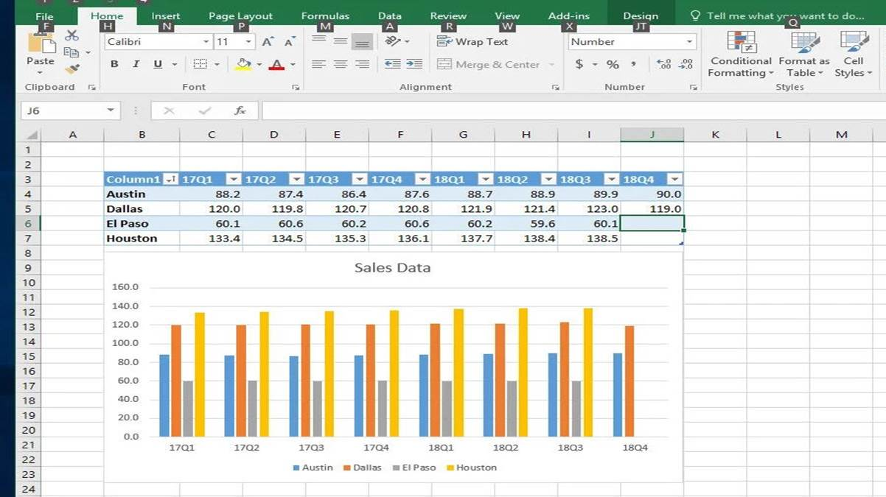
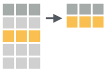
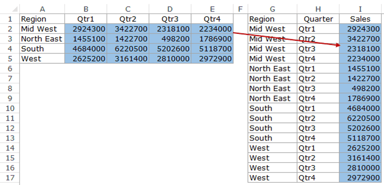

```{r setup, include = FALSE}
# libraries --------------------------------------------------------------------
library(anicon)
library(countdown)
library(DiagrammeR)
library(fontawesome)
library(knitr)
library(tidyverse)
library(xaringan)

# general options --------------------------------------------------------------
options(scipen = 999)
set.seed(123)
# chunk options ----------------------------------------------------------------
opts_chunk$set(
  cache.extra = rand_seed, 
  message = FALSE, 
  warning = FALSE, 
  error = FALSE, 
  echo = FALSE,
  cache = FALSE,
  comment = "", 
  fig.align = "center", 
  fig.retina = 3
  )
```

# Always Prepare the Data

.center[**To efficiently perform any kind of analysis on data, it is essential to format the data file in the most suitable way.**]

To do so, 2 steps are required:

1. Cleaning the data from any noise
2. Transforming the data in order to obtain the relevant variables 

---

class: inverse, mline, center, middle

# 1. Cleaning Data

---

# An Essential Step

.center[**Cleaning Data means removing any non-essential feature included in the spreadsheet**]

- If you don't have big data... then use Microsoft Excel! 

```{r out.width = "50%"}
include_graphics("https://miro.medium.com/max/624/1*FAzumPnvzKUDolMG7SNcHw.png")
```

- If you do have big data, then use R or Python.

---

# Question from Kareem

```{r out.width = "100%"}
include_graphics("img/clean_tweet.png")
```

---

# Exercise

## Find what is going wrong with this table

```{r out.width = "100%"}

```

---

# Answer from Michael

```{r out.width = "100%"}

```

---

# Use a Name Convention

An addition to Michael's list would be to transform headers with a proper naming convention

My suggestion is **snake_case**: all small letter and words separated by "_"

```{r out.width = "70%"}
include_graphics("img/name_convention.jpg")
```

---

# To Clean Data ...

### 1. Ditch the chart and all non values
Charts can mess up with other software

### 2. Column headings in row 1
No more than 1 heading row and remove blanks

### 3. Columns start at column A
Remove blanks before data

### 4. Use a naming convention
snake_case is preferable but any would do

### 5. Save as .csv file
Better format and keeps only the current sheet

---

class: title-slide, mline, center, middle

## Exercise: Clean unicef.xlsx

---

# Exercise: Clean unicef.xlsx

Unicef collects a lot of data but they don't know either how to process them or how to visualise them. The following file is coming from their official website and was the data used for the EDHEC European Data Visualisation Challenge: https://www.edhec.edu/en/student-dataviz-challenge-2022

### `r faa("arrow-circle-right", animate="horizontal", speed="slow", color="blue")` On the module Loop page, got to "Lecture Data" and download the document called "unicef.xlsx"

### `r faa("arrow-circle-right", animate="horizontal", speed="slow", color="blue")` Open and clean the 1st sheet of this file

```{r}
countdown(minutes = 15, warn_when = 60)
```

---

class: inverse, mline, center, middle

# 2. Data Transformation

---

# Master the Key Transformations

Most important work is to tidy your data: 
- Takes time to saves time and solves problems
- Only 5 key transformations need to be mastered

.pull-left[
## 1. Extension

## 2. Reduction

## 3. Direction

## 4. Aggregation

## 5. Combination
]

.pull-right[
```{r out.width = "70%"}
include_graphics("img/key_movements.png")
```
]

---

# Extension

.center[**Extension = Create a new column**]

```{r out.width = "50%"}

```

In MS Excel:
  - First row is row name (name convention)
  - Second row is the function (starts with = sign)
  - Following rows are applying the function (double click bottom right corner of the cell)

---

# Excel Functions

### For numeric values
  - Numeric operator ( + - / *)
  - $ (fixed parameter)
  - COUNT(), MIN(), MAX(), SUM(), AVERAGE (), STDEV()

### For character strings
  - LEFT()
  - CONCATENATE()

### Extra function
  - IF(condition, value if true, value if false)

---

# Reduction

.center[**Reduction = Keep only certain values**]

```{r out.width = "50%"}

```

In MS Excel:
  - Select header row
  - In Data tab, use Filter
  - Click the drop-down arrow for the column you want to filter
  - Choose values to filter

---

# Excel Filters

`r faa("exclamation-triangle", animate="flash", speed="slow", color="red")` Remember: 

- Rows already filtered have a row index are coloured in blue
- Copy-Paste filtered table in a new document if you want to work only on these values

```{r out.width = "50%"}
#| fig.cap: "Example of data filtered buy the column Country to keep only values corresponding to USA"
include_graphics("https://www.excel-easy.com/data-analysis/images/filter/filter-result.png")
```

---

# Direction

- Direction = Arrange Row Order

- In MS Excel:
  - Select table
  - In Data tab, use Sort
  - Choose column to sort and how to sort

```{r out.width = "40%"}
include_graphics("img/direction_img.png")
```

Be careful of taking into account all the table (all rows & all columns)

Double check if all columns changed!

---

# Aggregation

- Aggregation = Summary of Column

- In MS Excel:
  - Simple = use function at the end of a table
  - Complex = use pivot table
  
```{r out.width = "50%"}

```

---

# Pivot Table in Excel

1. Select data
2. In Insert, use Pivot Table
3. Drag columns to sort by row/column
4. Choose value column to be aggregated
5. Choose type of aggregation

If you want to use the Pivot Table for further analysis:

- Copy-Paste it in another document
- Paste as value (removes dynamic link)

---

# Combination

- Combination = Join two tables

- In MS Excel:
  - One Column = vlookup function
  - Multiple Columns = Power Query (Windows only)
  
```{r out.width = "50%"}
include_graphics("img/combination_img.png")
```

--

### =VLOOKUP(value, table, col_index, [range_lookup])

- value: The value the common column between the 2 tables
- table: The 2nd table containing the value to import in the 1st table
- col_index: Column number of the 2nd table containing the value to import
- range_lookup: TRUE = approximate match / FALSE = exact match

`r faa("exclamation-triangle", animate="flash", speed="slow", color="red")` Remember to use `$` in the table coordinates if you want to apply the function on multiple cells.

---

class: title-slide, mline, center, middle

## Exercise: Transformations

---

# Exercise: Transformations

On the module Loop page, got to "Lecture Data" and download the document called "organisation_alpha.xls"

1. **Extension**: Create a new variable/column which is the average sales per quarter in 2021 and 2022 for each employee
2. **Reduction**: Filter employee’s 2022 salary to keep only employees with a salary higher than 30k and revert back to the full dataset
3. **Aggregation**: Calculate the average salary by gender and by location
4. **Combination**: Using the VLOOKUP function, add to the table a column corresponding to the  2020 salary located in the 2nd sheet

```{r}
countdown(minutes = 10, warn_when = 60)
```

---

class: inverse, mline, center, middle

# Extra Analytic Tips

---

# Tidy Data

- Each variable has its own column 
- Each observation is placed in its own row 
- Each value is placed in its own cell

```{r out.width = "100%"}
include_graphics("img/tidy_full.png")
```

---

# Long or Wide?

## Long Format

```{r out.width = "80%"}
include_graphics("img/long_table.png")
```

## Wide Format

```{r out.width = "80%"}
include_graphics("img/wide_table.png")
```

---

# Long or Wide?

```{r out.width = "100%"}
include_graphics("img/long_or_wide.png")
```

--

```{r out.width = "100%"}

```

---

# Reshape Table in Excel

In Data tab:

1. Get Data/New Query> From File > From [Workbook/CSV]
2. Select your file > Edit
3. Select columns to be reshaped
4. Transform
  - Pivot Columns: from long table to wide table
  - Unpivot Columns: from wide to long table
  
```{r out.width = "50%"}
include_graphics("img/reshape_excel.gif")
```

---

# Repeat Action Automatically

In Excel, the Macro button allows to record a sequence of  actions and to reproduce these actions:

- VBA Code automatically recorded
- Useful to process similar data files

Recording a Macro:

1. View Tab
2. Use Macros > Record Macro
3. Do your actions
4. Save the macro with a keyboard shortcut
5. Use the macro again to reproduce your actions

---

# Online Trainings

## Mandatory Online Trainings on Kubicle

Excel Essentials
- [Data Manipulation and Formatting](https://app.kubicle.com/courses/data-manipulation-and-formatting) (150 min)
- [Formulas and Functions](https://app.kubicle.com/courses/formulas-and-functions) (210 min)

Data Analysis
- [Lookups and Database Functions](https://app.kubicle.com/courses/lookups-and-database-functions) (150 min)
- [Pivot Tables](https://app.kubicle.com/courses/pivot-tables) (150 min)

## Optional Free Online Trainings

More about MS EXCEL with free online learning on Udemy.com (needs free registration):

- [Excel Quick Start Tutorial (36 min)](https://www.udemy.com/course/excel_quickstart/) 
- [Ten Excel Features Every Analyst Should Know (30 min)](https://www.udemy.com/course/ten-excel-features-every-analyst-should-know/) 
- [Excel Dashboards (60 min)](https://www.udemy.com/course/excel-dashboards-in-an-hour/) 

---
class: inverse, mline, left, middle


# Thanks for your attention and don't hesitate to ask if you have any question!

[`r fontawesome::fa(name = "twitter")` @damien_dupre](http://twitter.com/damien_dupre)  
[`r fontawesome::fa(name = "github")` @damien-dupre](http://github.com/damien-dupre)  
[`r fontawesome::fa(name = "link")` damien-datasci-blog.netlify.app](https://damien-datasci-blog.netlify.app)  
[`r fontawesome::fa(name = "paper-plane")` damien.dupre@dcu.ie](mailto:damien.dupre@dcu.ie)
