```{r setup, include = FALSE}
# libraries --------------------------------------------------------------------
library(anicon)
library(countdown)
library(knitr)

# general options --------------------------------------------------------------
options(
  scipen = 999,
  htmltools.preserve.raw = FALSE,
  knitr.kable.NA = " - "
  )
set.seed(42)

# chunk options ----------------------------------------------------------------
opts_chunk$set(
  cache.extra = rand_seed, 
  message = FALSE, 
  warning = FALSE, 
  error = FALSE, 
  echo = FALSE,
  cache = FALSE,
  comment = "", 
  fig.align = "center", 
  fig.retina = 3
  )

```

# Previously ...

We have seen how important data visualisations are to convince an audience when included in a story/narrative.

We have also seen that data visualisations can contain mistakes or,  even worst, can lie and have to be displayed with ethics and professionalism.

Finally, we have seen that data visualisations have a certain meaning according to the type of figure used (i.e., Composition, Distribution, Comparison, and Relationship) and they have to be created following basic visualisation principles.

### `r faa("arrow-circle-right", animate="horizontal", speed="slow", color="blue")` Now it's time to practice with Power BI

---

class: inverse, mline, center, middle

# 1. Power BI Context

---

# Context

Power BI is a suite of Data Visualisation Software/Cloud-based Service: 

- Developed and licensed by Microsoft
- Appeared in 2011

Power BI is said to be focusing on Business Intelligence but it really only is a **no-code** tool to create better visualisation than MS Excel does.

Now part of the Microsoft **Azure** ecosystem made of cloud computing services (equivalent to AWS and Google Cloud).

```{r out.width = "38%"}
include_graphics("https://media.makeameme.org/created/brace-yourself-power-597838.jpg")
```
.center.tiny[Source: makeameme.org [`r emo::ji("link")`](https://media.makeameme.org/created/brace-yourself-power-597838.jpg)]

---

# Different Versions

- Power BI Desktop 

The **Windows OS** only software, primarily for designing and publishing reports to the Service.

- Power BI Service

The **SaaS-based** (software as a service) online service can be used from any web browser.

- Power BI Premium

Capacity-based offering that includes flexibility to publish reports broadly across an enterprise, without requiring recipients to be licensed individually per user. Greater scale and performance than shared capacity in the Power BI Service

- Other Components

Power BI Mobile Apps, Power BI Gateway, Power BI Embedded, Power BI Report Server, Power BI Visuals Marketplace

---

# DCU Access

Student subscription to Microsoft 365 comes with Power BI Service

.pull-left[
To access it:

1. Go to https://powerbi.microsoft.com
3. Click on **Have an account? Sign in**
2. Sign in with your DCU login and password
]

.pull-right[
```{r out.width='100%'}
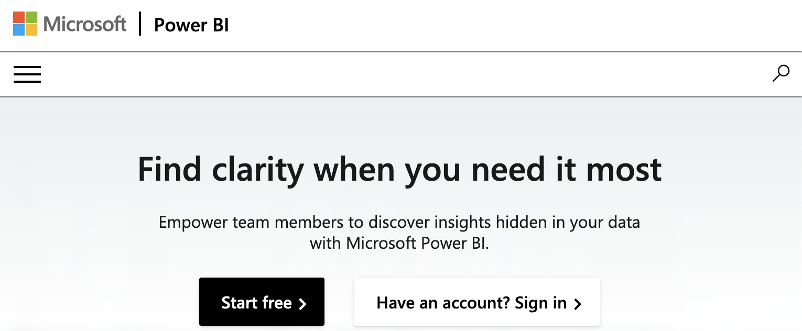
```
]

You should land on the following welcome page.

```{r out.width='100%'}
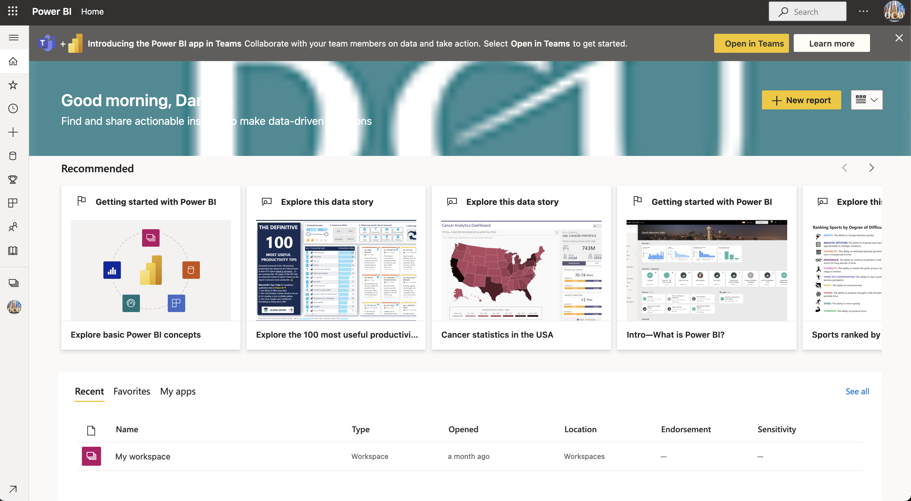
```

---
class: title-slide, middle

## Live Demo

---

class: inverse, mline, center, middle

# 2. Power BI Basic Features

---

# Canvas Area

Because we've opened a dashboard, the canvas area displays visualization tiles. If for example, we had opened the report editor, the canvas area would display a report page.

Power BI is super polite and will welcome you in your organisation.

It will also offer you a button **+ Report** which is a shortcut for the **+ Create** option from the menu. Both are the starting point for new visualisations

```{r out.width='100%'}

```
.center.tiny[Thank you for your greetings Power BI]
---

# Recommended and Recent

You will also have a quick access to your previous work and to default official tutorials in case you are discovering the tool.

These tutorials are strongly recommended if you want to progress with Power BI.

```{r out.width='100%'}
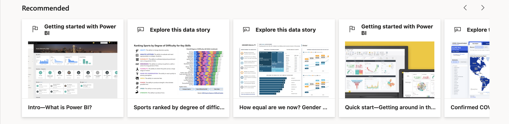
```

The recent tab box allows you to have another quick access to your previous work.

```{r out.width='100%'}
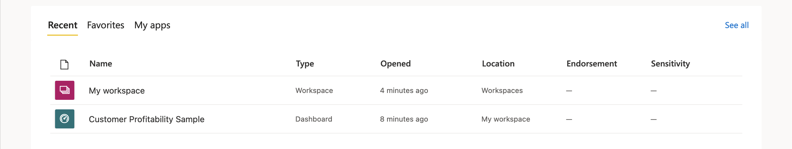
```

---

# Naviagation Pane

Always on the left side, it can be minimised with the hamburger menu button

.left-column[
```{r out.width='30%'}
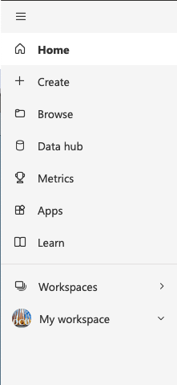
```
]

--

- Home will bring you back to the welcome page
--

<br><br>

- Create is the main access to create visualisations and dashboards
--

<br><br>

- Browse lists visualisations and dashboards you previously used
--

<br><br>

- The data hub lists the data you previously used
--

<br><br>

- Connection to your organisation database and web services 
--

<br><br>

- Metrics and Monitoring hub creates and access your "scorecards" 
--

<br><br>

- Shortcut to the [Microsoft learning platform for Power BI tutorials](https://docs.microsoft.com/en-us/learn/powerplatform/power-bi)

---

# Vocabulary

- **Workspaces** are distinct servers (personal or shared) hosting dashboards, reports, workbooks, datasets, and dataflows.

- **Dataflows** represent data prepared and staged for use by datasets to facilitate reporting

- **Datasets** are collection of data that you import or connect to. Each listed dataset is a source of data available for one or more reports, and the dataset may contain data that comes from one or more sources. 

- **Reports** are one or more pages of visualizations such as line charts, maps, and treemaps. All of the visualizations in a report come from a single dataset. By default, the report opens in Reading view. Just select Edit report to open it in Editing view (if you have the necessary permissions).

- **Dashboards** are single canvas (i.e., screens)  that contains zero or more tiles and widgets. Each tile pinned from a report displays a single visualization that was created from a dataset. Entire report pages can also be pinned to a dashboard as a single tile. 

- **Workbooks** are a special type of dataset when you use Get data. However, You can't edit your workbook in Power BI, you need to do it with MS Excel.

---

# Vocabulary

```{r out.width='80%'}
include_graphics("https://cdn-aldpb.nitrocdn.com/MmRYricBGnwFelNvIykEOHWwZuUwjnwj/assets/images/optimized/rev-418456f/spreadsheeto.com/wp-content/uploads/2019/11/powerbi-diagram.png")
```
.center.tiny[Source: How to Create Your First Power BI Dashboard (Step-by-Step) [`r emo::ji("link")`](https://spreadsheeto.com/power-bi-dashboard/)]

---
class: title-slide, middle

## Live Demo

### Go to: **Learn (Nav. Pane)** `r emo::ji("right arrow")` Sample Report `r emo::ji("right arrow")` Open "Store Sales"

---

class: inverse, mline, center, middle

# 3. Create New Visualisations

---

# Step 1: Manually Import Data

.pull-left[
In the module's Loop page:

- Go to the **Lecture Data** tile and open the **organisation_alpha** file with MS Excel
- Select the first table and copy it (Ctrl+C or Cmd+C)
]

.pull-right[
```{r out.width='100%'}
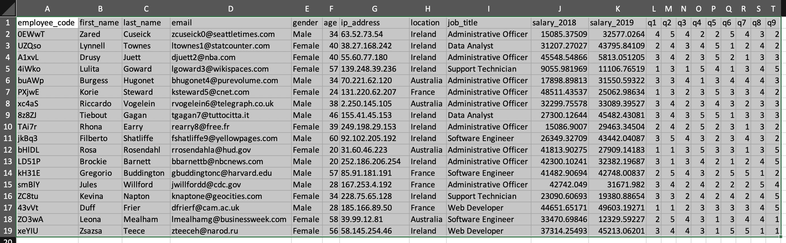
```
]

.pull-left[
In Power BI Service:

- Click **Create** and **Paste or manually enter data**
- Click in the empty table (except in the Cell 1 Column 1) and paste the table (Ctrl+V or Cmd+V)
- Click on **Use first row as headers** only once
]

.pull-right[
```{r out.width='100%'}
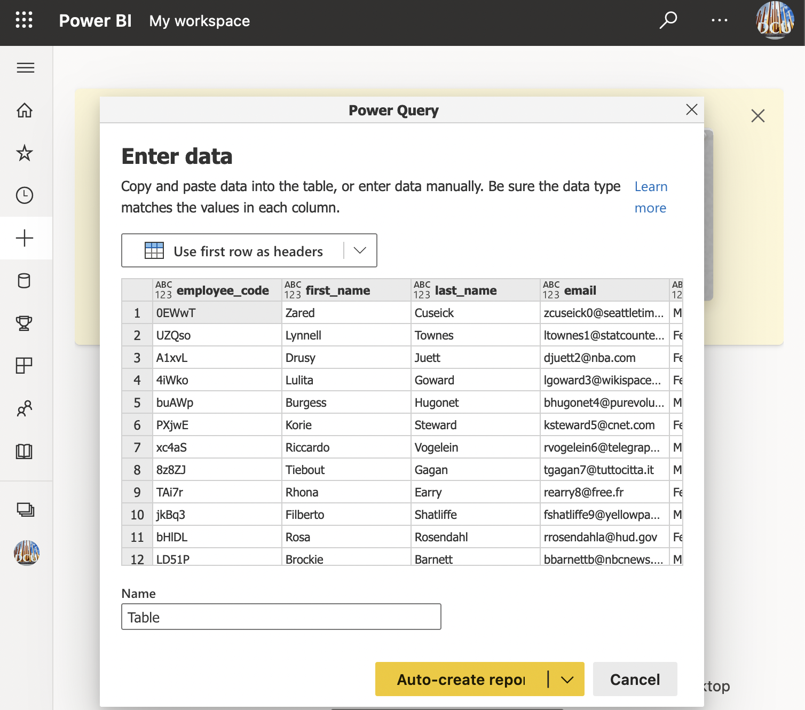
```
]

---

# Step 1: Manually Import Data

```{r out.width='100%'}
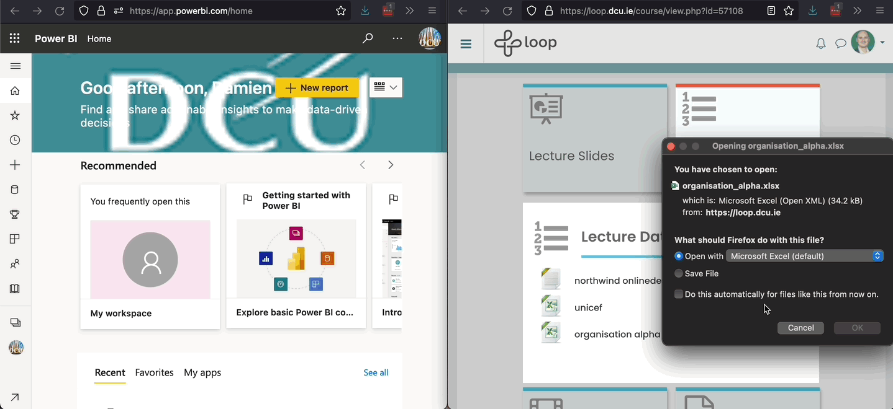
```

Then choose between:

- Auto create report
- Create a blank report
- Create a dataset only

---

# Step 2: Create a Report

```{r out.width='90%'}
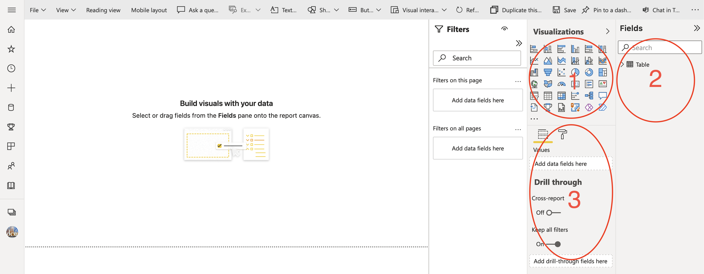
```

In Power BI canvas: 

1. Choose the visualisation (i.e., composition, distribution, comparison, relationship)

2. Choose the variable(s) by unfolding the list ( $\Sigma$ indicates continuous variables)

3. Drag and drop the variables in the relevant fields and customise the features

---

# Variable Type and Visualisations

```{r out.width='20%'}
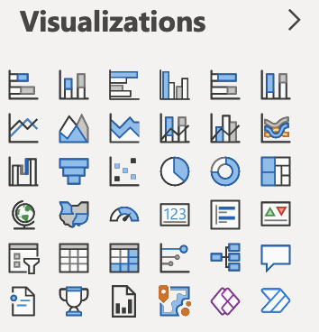
```

Remember, there is a type of visualisation for each type of variables:

- **Composition** (i.e. bar/column and pie charts) for **1 categorical variable**

- **Distribution** (i.e. histogram, density, box plot and dynamite charts) for **1 continuous variable**

- **Comparison** for **2 categorical variables** or for **1 categorical variable and 1 continuous variable**

- **Relationship** (i.e. scatterplot with regression line) for **2 continuous variables**

---
class: title-slide, middle

## Composition Figures

---

# Composition Figures

```{r out.width='100%'}
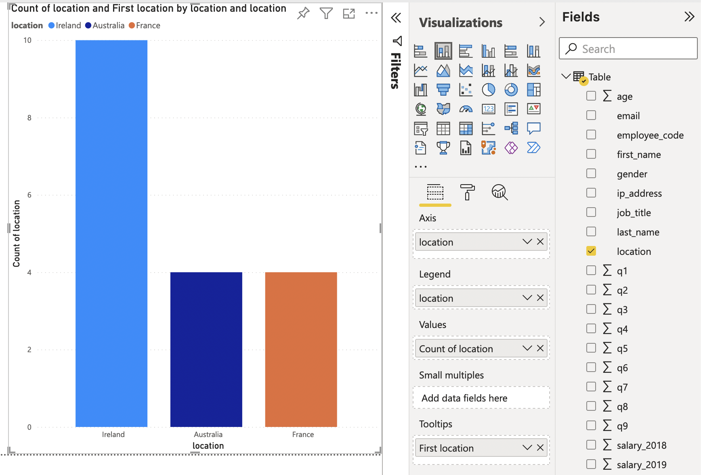
```

---

# Composition Figures

```{r out.width='100%'}
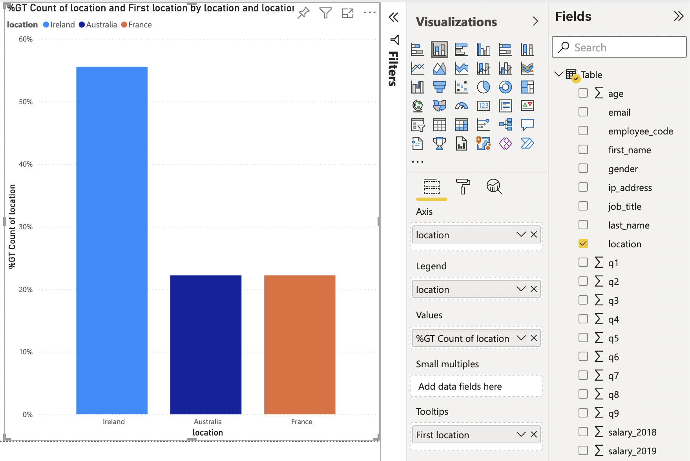
```

---

# Composition Figures

```{r out.width='100%'}
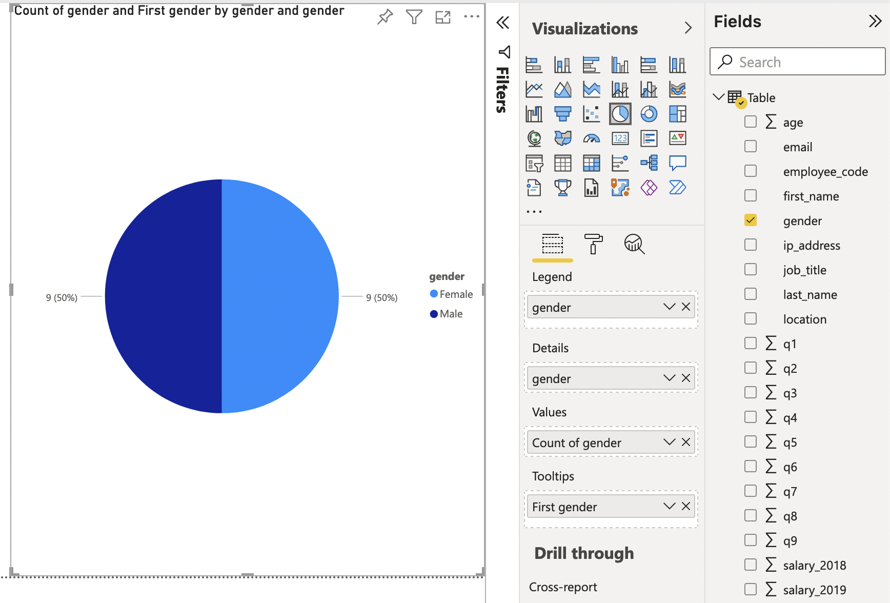
```

---
class: title-slide, middle

## Distribution and Comparison Figures

---

# Distribution and Comparison Figures

Distribution visualisation are based on specific calculations to aggregate the data in order to obtain:

- Histograms
- Density plots
- Box plots
- Dynamite plots

Unfortunately, Power BI is extremely limited for those.

- Density plots are unavailable
- Histograms and box plots are available only with add-on visuals (most of them are free)
- Dynamite plots are partly available (average bar without SD whiskers)

---

# Distribution and Comparison Figures

```{r out.width='100%'}
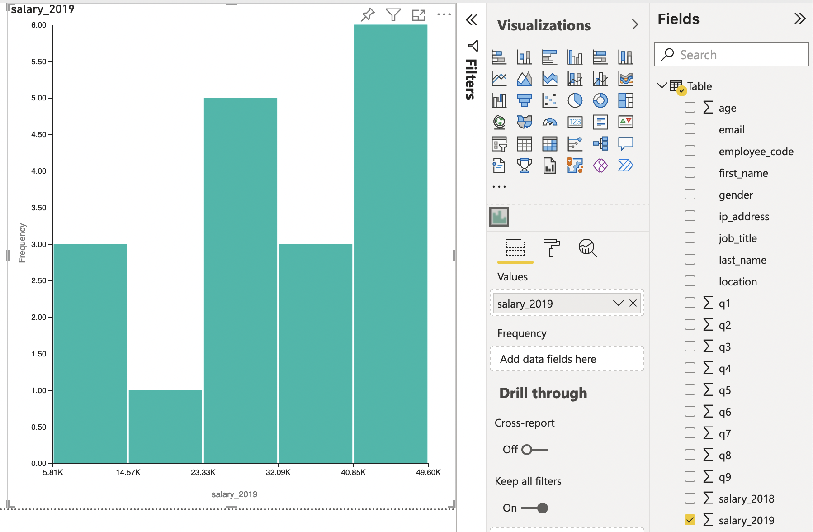
```

---

# Distribution and Comparison Figures

```{r out.width='100%'}
include_graphics("img/powerbi_distribution_2.png")
```

---
class: title-slide, middle

## Relationship Figures

---

# Relationship Figures

The scatterplot is the best way to display the relationship between 2 continuous variables ( $\Sigma$  variables in the list of fields)

However, it is essential to use **Don't summarize** for both axes instead of the default Sum for aggregation

A trend line can be added from the **Analytics** option.

---

# Relationship Figures

```{r out.width='100%'}
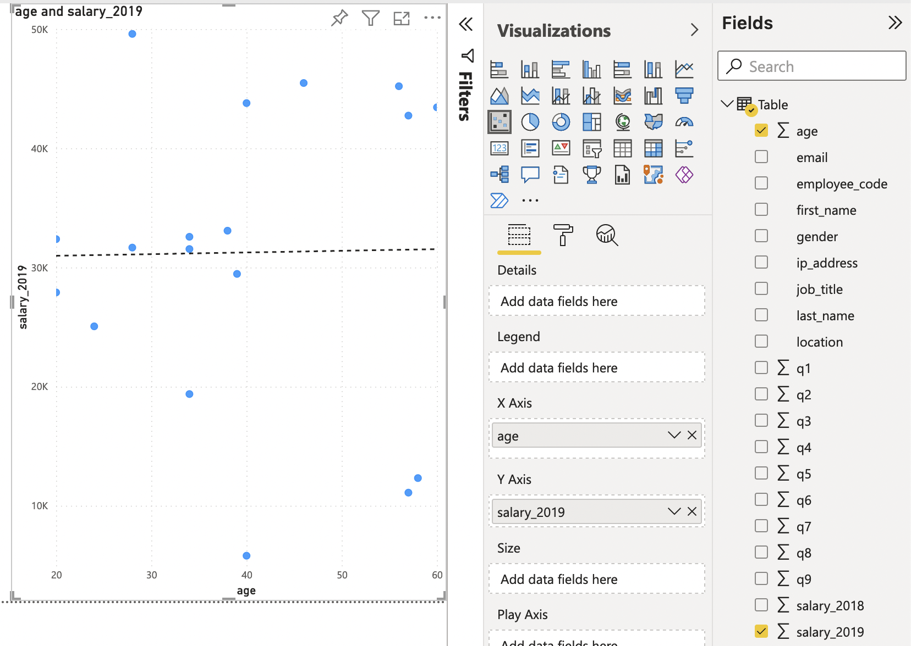
```

---
class: title-slide, middle

## Additional Visualisations: Timeseries and Maps

---
# Timeseries and Maps Figures

While Categorical and Continuous are the two most common types of variable, they are not the only ones.

Timeseries and Maps require each a new type of variable:

- Dates for timeseries
- Geographic information for maps (locations or longitude/latitude)

Multiple additional types of visualisation are available in Power BI. Their added value can vary but the if you are able to explain them then don't hesitate to use them.

```{r out.width='60%'}
include_graphics("https://powerbicdn.azureedge.net/cvt-9394a7615e76e3565238e1688022efbee201671e2cbb78c8d1b1df694b985908/pictures/pages/index/blade2/powerbi-001.jpg")
```
.center.tiny[Source: Microsoft Corp. [`r emo::ji("link")`](https://powerbi.microsoft.com)]

---
# Timeseries and Maps Figures

```{r out.width='100%'}
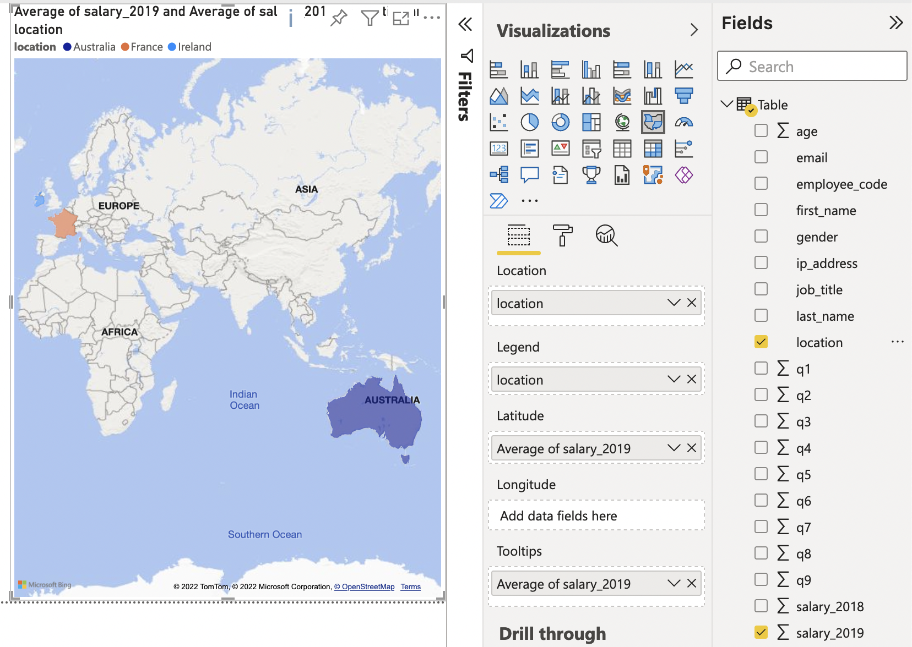
```

---

class: inverse, mline, center, middle

# 4. Dashboards with Power BI

---

# Dashboards with Power BI

Dashboards are obtained by **Pinning specific visualisations from one or multiple reports**

```{r out.width='100%'}
include_graphics("https://zebrabi.com/wp-content/uploads/2020/04/2020-04-22_13-53-06.jpg.webp")
```
.center.tiny[Source: The Most Effective Power BI Dashboard Tips and Tricks [`r emo::ji("link")`](https://zebrabi.com/top-power-bi-dashboard-tips-and-tricks/)]

---

class: inverse, mline, center, middle

# 5. Power BI Practice

---

# Practice Data

In order to show you how to use Power BI, we are going to exercise with the dataset called **titanic**.

The most interesting outcome variable is the survive variable which says if the passenger has survived (coded 1) or not (coded 0)

```{r}
include_graphics("https://miro.medium.com/v2/resize:fit:1400/format:webp/1*JtEf9FVlJqxRDhhu0ec3fw.png")
```

---

# Titanic Dataset

```{r out.width='100%'}
include_graphics("http://user-images.strikinglycdn.com/res/hrscywv4p/image/upload/c_limit,f_auto,h_2000,q_90,w_1200/107158/Screen_Shot_2015-08-03_at_1.57.45_AM_ibp1u8.png")
```

Variables:
- Survival (0 = No; 1 = Yes)
- Passenger Class (1st; 2nd; 3rd)
- Name, Sex, Age, Cabin
- sibsp - Nb of Siblings/Spouses Aboard
- parch - Nb of Parents/Children Aboard
- ticket - Ticket Number
- fare - Passenger Fare
- embarked - Port of Embarkation (C = Cherbourg, Q = Queenstown, S = Southampton)

---

# Dashboard Topic

Usually when you process data you have a motivation or interest in processing the Data

Here this practice data is dummy but we can still try to make it interesting by solving the following question:

- #### Titanic: “women and children first” or “every man for himself”?

By using **1 Composition Figure**, **1 Comparison Figure** and **1 Relationship Figure** we will try to answer this question from the data obtained.

```{r out.width='30%'}
include_graphics("https://rss.onlinelibrary.wiley.com/cms/asset/70b0be43-c955-49b3-bf12-ec04f17c1240/sign1229-gra-0002-m.jpg")
```

---

class: title-slide, middle

## Use **titanic.csv** to create a Power BI Report

Design: 
- **1 Pie Chart using Survival variable**
- **1 Bar Chart Proportion using Survival, Sex and Embarked variables**
- **1 Scatterplot using Fare, Age and Survival variables**

Then, **pin these 3 visualisation on a Power BI dashboard** and to **add the text** from the document `text_dashboard.txt` to convey your narrative.

`r faa("exclamation-triangle", animate="flash", speed="slow", color="red")` The Survival variable will be recognised as continuous and not as categorical, you have to change its type.

```{r}
countdown(minutes = 20, warn_when = 60)
```

---

# Optional Free Trainings

Visualisations with Power BI:
- [Explore Power BI World!](https://www.udemy.com/course/explore-power-bi/)
- [Power BI - The Ultimate Orientation](https://www.udemy.com/course/power-bi-the-ultimate-orientation/)
- [Power BI Tutorial From Beginner to Pro ⚡ Desktop to Dashboard in 60 Minutes ⏰](https://www.youtube.com/watch?v=AGrl-H87pRU)
- [How to use Microsoft Power BI - Tutorial for Beginners](https://www.youtube.com/watch?v=TmhQCQr_DCA)

---
class: inverse, mline, left, middle


# Thanks for your attention and don't hesitate to ask if you have any question!

[`r fontawesome::fa(name = "twitter")` @damien_dupre](http://twitter.com/damien_dupre)  
[`r fontawesome::fa(name = "github")` @damien-dupre](http://github.com/damien-dupre)  
[`r fontawesome::fa(name = "link")` damien-datasci-blog.netlify.app](https://damien-datasci-blog.netlify.app)  
[`r fontawesome::fa(name = "paper-plane")` damien.dupre@dcu.ie](mailto:damien.dupre@dcu.ie)