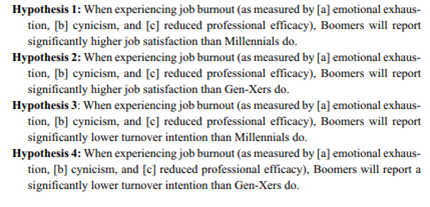
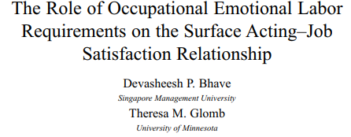
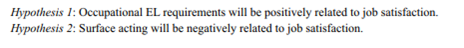
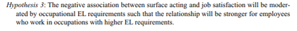

```{r setup, include = FALSE}
# general options --------------------------------------------------------------
options(
  scipen = 999,
  htmltools.preserve.raw = FALSE,
  knitr.kable.NA = " - "
  )
set.seed(42)
# chunk options ----------------------------------------------------------------
knitr::opts_chunk$set(
  cache.extra = knitr::rand_seed, 
  message = FALSE, 
  warning = FALSE, 
  error = FALSE, 
  echo = FALSE,
  cache = FALSE,
  comment = "", 
  fig.align = "center", 
  fig.retina = 3
  )
# libraries --------------------------------------------------------------------
library(tidyverse)
library(knitr)
library(kableExtra)
library(nomnoml)
library(DiagrammeR)
library(ggrepel)
library(fontawesome)
library(tweetrmd)
library(plotly)
library(gapminder)
library(patchwork)
library(webshot2)
library(VennDiagram)
library(countdown)
# data -------------------------------------------------------------------------
dnd <- readr::read_csv(here::here("data/dnd.csv"))
```

# Previoulsy ...

We have seen how to:

- Extract data from databases with SQL queries
- Clean and Transform data tables with MS Excel
- Visualise data with interactive Tableau dashboards

```{r out.width='80%'}
include_graphics("https://d33wubrfki0l68.cloudfront.net/571b056757d68e6df81a3e3853f54d3c76ad6efc/32d37/diagrams/data-science.png")
```

**It is time to model the data and to perform statistical analyses!**

---

# Why Statistics?

Ask to yourself: *"Why do you do statistics? Why don't scientists just use common sense?"*

The best answer is a really simple one: **we don't trust ourselves enough**, therefore much of statistics is basically a safeguard

--

Scientific reasoning  requires to engage in **induction**, making wise guesses about the relationship between 2 or more variables (also called **Hypothesis**) and to make generalisations about the world.

--

Scientists can't solve **deductive** problems (ones where no guessing is required) without being influenced by pre-existing biases. **Deductive research** is also called HARKing (hypothesizing after the results are known)

---

# Alternative vs. Null Hypotheses

Every hypothesis has to state relationship between variables also called $H_a$ (for alternative hypothesis) or $H_1$

Every hypothesis has a null hypothesis counterpart (no relationship between variables) also called $H_0$ (pronounce H naught or H zero)
  
**Statistics are used to test the probability of obtaining your results if the Null Hypothesis is true. If this probability is low, then we reject the Null Hypothesis (and consider the Alternative Hypothesis as credible).**

---

# Concept Relationships

```{nomnoml, fig.width=12, fig.height=3}
#stroke: black
#direction: right
#align: center
[Variables]->[Hypotheses]
[Hypotheses]->[Model]
[Model]->[Equation]
```

---

# Today's Menu

Statistics is not (only) about producing numbers, it's a method to insure that results obtained about the relationship between two or more variables with a sample can be generalised to the overall population.

Therefore, it is necessary to understand:

1. What are predictor, outcome and control variables?
2. How to hypotheses of the relationship between variables?
3. What are models and how to represent them with an equation?
4. How to test the model's equation and taking a decision about its hypotheses?
5. How to report the results of statistical analyses?

---
class: inverse, mline, center, middle

# 1. Predictor, outcome and control variables

---

# What is a Variable?

A variable itself is a subtle concept, but basically it comes down to finding some way of **assigning numbers or characters to labels**.

- **My FirstName** is *Damien*.
- **My LastName** is *Dupré*.
- I **ordered** *1x24 pieces* of *Escargots de Bourgogne*.

The **bold part is "the thing that varies"**, and the *italicised part is "the value of the variable"*.

---

# Operationalisation

When creating a variable... 

**... Be precise about what you are trying to measure/compare**
- For instance, does "age" mean "time since birth" or "time since conception" in the context of your research?

**... Determine what method you will use to measure/compare it**
- Will you use self-report to measure age, ask a parent, or look up an official record? If you're using self-report, how will you phrase the question?

**... Define the set of allowable values that the variable can take**
- These values don't always have to be numerical, though they often are.

---

# Categories of Variable

Variables can have different types:

- **Categorical**: If the variable's possibilities are words or sentences (character string)
  - if the possibilities cannot be ordered: Categorical Nominal (*e.g.*, gender)
  - if the possibilities can be ordered: Categorical Ordinal (*e.g.*, opinion from disagree to agree)
- **Continuous**: If the variable's possibilities are numbers (*e.g.*, age, temperature) 

> Warning: Variables can be converted to either Categorical and Continuous but it is always better to keep them in their correct scale.

---

# Latent Variables

A questionnaire/survey is made of multiple questions (also called items)

All items that are related to the measurement of a same theoretical construct are constituting a scale.

The theoretical construct measured by the scale is called Latent Variable.

To be analysed a scale has some requirements:

1. All the items must have the same range of possibilities/modalities
2. All the items must correlate together (scale reliability)
3. A unique theoretical construct score has to be calculated from all the items even if it contains subscales.

There are two way to obtain the score of a Latent Variable: 

- Average of all items (reversed if necessary)
- Factor/Component analysis

---

# Latent Variables

Scale to measure the "Perceived Ease-of-use" of Tableau:

.pull-left[
- q1. I think learning Tableau is easy

- q2. Understanding Tableau is easy

- q3. I am good at using Tableau

- q4. I think using Tableau is easy
]

.pull-right[
```{r}
DiagrammeR::grViz("
digraph rmarkdown {
  graph [rankdir = RL]
  
  node [shape = oval]
  'Perceived Ease-of-use'
  
  node [shape = box]
  q1; q2; q3; q4
  
  'Perceived Ease-of-use'-> {q1 q2 q3 q4}   

}
", height = 200)
```
]

--

These 4 items were measured from 1 "totally disagree" to 7 "totally agree" with 3 students. The score of the "Perceived Ease-of-use" latent variable is calculated using the average of all items.

```{r}
tribble(
  ~ppt, ~q1, ~q2, ~q3, ~q4,
  "a",   7,  5,   7,   7,
  "b",   5,  4,   6,   6, 
  "c",   3,  1,   2,   3
) %>% 
  rowwise() %>% 
  mutate(peo_score = mean(q1, q2, q3, q4)) %>% 
  kable()
```

---

# Validity and Reliability

**Validity = is my variable measuring the construct that I think I am measuring?**
- Does the measurement make sense? 
- Would the results be reproduced with another scale measuring the same latent variable?
- Are the results correlated to latent variables that are related?

Validity test is only performed when a scale is created (no need for existing scales)

**Reliability = consistency of items inside a measurement**
- Test-retest reliability
- Inter-rater reliability
- Correlation inter-item (Cronbach's alpha)

Reliability test is performed every time a scale is used but only using Cronbach's alpha

---

# Validity and Reliability

```{r out.width = "50%"}
knitr::include_graphics("https://www.publichealthnotes.com/wp-content/uploads/2018/08/560px-Reliability_and_validity.svg_.png")
```

---

# Predictors, Outcomes and Controls

It's important to keep the two roles "variable doing the explaining" and "variable being explained" distinct.

Let's denote the:
 - Outcome: "to be explained" variable as Y (also called Dependent Variable or DV)
 - Predictor: "doing the explaining" as X (also called Independent Variable or IV)

Statistics is only about identifying relationship between variables also called **effect**

> An effect between 2 variables mean that the changes in the values of a predictor variable are related to changes in the values of an outcome variable

---

# Predictors, Outcomes and Controls

An effect between a predictor variable $X$ and an outcome variable $Y$ corresponds to the following model:

```{nomnoml, fig.width=12, fig.height=3}
#stroke: black
#direction: right
#align: center

[X]->[Y]
```

To prove this effect, an hypothesis should be formulated and tested:
- "the variable $Y$ is explained by the variable $X$"
- "the variable $X$ is explaining the variable $Y$"
- "the variable $X$ influences the variable $Y$"
- "there is an effect/ a relationship between $X$ and $Y$"

Note, despite having different formulation these hypotheses are all about the same effect suggesting a correlation which is not causation.

---

# Predictors, Outcomes and Controls

A significant effect of a predictor on an outcome variable means that a variable $X$ is explaining enough variance of the variable $Y$ to show a significant relationship.

.pull-left[

If there is no effect between the variables, they are not sharing enough of their variability

```{r}
venn.plot <- draw.pairwise.venn(
  100, 100, 10, c("Predictor", "Outcome"), ind = FALSE, cex = 5, cat.cex	= 2, cat.pos	
= c(0,0))
grid.draw(venn.plot)
```

]

.pull-right[

If there is an effect between the variables, they are sharing a big part of their variability

```{r}
venn.plot <- draw.pairwise.venn(
  100, 100, 40, c("Predictor", "Outcome"), ind = FALSE, cex = 5, cat.cex	= 2, cat.pos	
= c(0,0))
grid.draw(venn.plot)
```
]

---

# Predictors, Outcomes and Controls

To decide, if the part of the shared variability is big enough to state that effect between the variables can be generalised to the overall population, a statistical test is required.

The statistical test produces a *p-value* which is between 0% and 100% which corresponds to a value between 0.0 and 1.0

**If the *p-value* is lower to 5% or 0.05, then the probability to obtain your results knowing that there is no effect between the variables is low enough to say ...**

.center[**... "There MUST be an effect between these variables!"**]
  
---

# Predictors, Outcomes and Controls

## Correlation not Causation

Hypothesis testing evaluates how two or more variable are related or correlated, there is no assumption of one causing the other:

* An "effect" is reciprocal and does not involves causality
* Causality analysis is an other kind of test that involves:
  1. To be sure that 2 variables are correlated
  2. That one variable is the antecedent of the other
  3. That no other variable is explaining this relationship

## Control Variables

They are included in the statistical test but there is no hypothesis about their effect.

They are used to remove an irrelevant explanation of the variable changes.

---
class: title-slide, middle

## Applied Example

---

# Applied Example

I'm the CEO of the IT company D&D which has 1000 employee on 3 different locations. I see many employees who are dissatisfied with their job and I want to understand why. I think it's related to their salary.

My research question is: Does employee's salary have an effect on employee's job satisfaction?

To me this is the case and I'm formulating the following hypothesis: Employee's job satisfaction increases when their salary increases.

In this example:
- Salary is the predictor
- Job Satisfaction is the outcome
- I'm predicting an effect of Salary on Job Satisfaction

```{nomnoml, fig.width=12, fig.height=2}
#stroke: black
#direction: right
#align: center

[Salary]->[Job Satisfaction]
```

---

# Applied Example

.pull-left[

If salary has no effect on job satisfaction, they are not sharing enough of their variability to say that they are related

```{r}
venn.plot <- draw.pairwise.venn(
  100, 100, 10, c("Salary", "Job Satisfaction"), ind = FALSE, cex = 5, cat.cex	= 2, cat.pos	
= c(0,0))
grid.draw(venn.plot)
```

]

.pull-right[

If salary has an effect on job satisfaction, they should share a big part of their variability

```{r}
venn.plot <- draw.pairwise.venn(
  100, 100, 40, c("Salary", "Job Satisfaction"), ind = FALSE, cex = 5, cat.cex	= 2, cat.pos	
= c(0,0))
grid.draw(venn.plot)
```
]

---

# Applied Example

To test my hypothesis, I asked as sample of employee to fill out the questionnaire which contains a job satisfaction scale made of 4 items (from 0 to 10) and their salary.

First I need to calculate the score of the job satisfaction latent variable by calculating the average of all questions, then I need to check if salary and job satisfaction share some part of variance and finally if this relationship is reliable enough to be generalised to all employees.

```{r}
tribble(
  ~employee, ~salary, ~q1, ~q2, ~q3, ~q4,
  1,         45000,   1,   5,   3,   2, 
  2,         55000,   5,   4,   6,   6,
  3,         70000,   3,   1,   2,   3,
  4,         80000,   8,   5,   2,   7, 
  5,         95000,   8,   9,   6,   5,
  6,         75000,   3,   1,   2,   1,
  7,         50000,   5,   2,   7,   7, 
  8,         45000,   1,   4,   6,   9,
  9,         65000,   3,   1,   2,   3
) %>% 
  rowwise() %>% 
  mutate(js_score = mean(q1, q2, q3, q4)) %>% 
  kable() %>%
  kable_styling(bootstrap_options = "striped", font_size = 15)
```

---
class: title-slide, middle

## Exercise: Inspecting an Academic Research Paper

On the module's Loop page, in the "Additional Content and Links" tile, open the academic research paper "Predicting student satisfaction and perceived learning within online learning environments" by Emtinan Alqurashi (2019) and:

1. Identify the research questions
2. Identify the predictor variables and the outcome variables
3. Formulate the hypotheses tested

```{r}
countdown(minutes = 10, warn_when = 60)
```

---

# Solution

Research questions: All 4 presented page 6 of the document (137 of the academic paper)

Variables: 
- Online Learning Self-Efficacy (OLSE) = Predictor
- Learner–Content Interaction (LCI) = Predictor
- Learner–Instructor Interaction (LII) = Predictor
- Learner-Learner Interaction (LLI) = Predictor
- Student satisfaction within online learning environments = Outcome
- Perceived learning within online learning environments = Outcome

Hypotheses:
- Student satisfaction increases when Online Learning Self-Efficacy (OLSE) increases
- Perceived learning increases when Online Learning Self-Efficacy (OLSE) increases
- Student satisfaction increases when Learner–Content Interaction (LCI) increases
- Perceived learning increases when Learner–Content Interaction (LCI) increases
...

---
class: inverse, mline, center, middle

# 2. How to formulate hypotheses?

---

# Hypothesis Testing

A hypothesis test consists of a test between two competing hypotheses:

- A null hypothesis $H_0$ (pronounced "H-naught") versus
- An alternative hypothesis $H_a$ (also called $H_1$)

Generally the null hypothesis is a claim that there is “no effect” or “no difference”. In many cases, the null hypothesis represents the status quo or a situation that nothing interesting is happening. Furthermore, generally the alternative hypothesis is the claim the experimenter or researcher wants to establish or find evidence to support. It is viewed as a “challenger” hypothesis to the null hypothesis $H_0$.

Testing hypotheses consists in evaluating the probability of having "the result obtained in my sample" knowing that the null hypothesis is true in the real life.

Warning: Hypothesis cannot test equality between groups or modalities, they can only test differences

---

# Hypotheses in a Nutshell

Hypotheses are:

1. Predictions supported by theory/literature
2. Affirmations designed to precisely describe the relationships between variables 

> *“Hypothesis statements contain two or more variables that are measurable or potentially measurable and that specify how the variables are related”* (Kerlinger, 1986)

Hypotheses include:

- Predictor(s) / Independent Variable(s)
- Outcome / Dependent Variable (DV)
- Direction of the outcome if the predictor increases

But there is only two kind of hypotheses: Main effect hypotheses and Interaction effect hypotheses

---

# Main Effect Hypothesis

Is the predicted relationship between one predictor and one outcome variable

Effect representation:

```{r eval=TRUE, fig.align="left"}
DiagrammeR::grViz("
  digraph {
    graph [rankdir = LR]
    
    'Predictor' -> 'Outcome'
  }", height = 200)
```

Warning: The direction of the arrow does not involve causality, only correlation.

---

# Main Effect Hypothesis

Its formulation depend on the type of predictor: Continuous or Categorical

--

- If the predictor is Continuous:

.center[The {**outcome**} {**increases or decreases**} when {**predictor**} {*increases/decreases/changes*}]

> Example: **Job satisfaction** *increases* when **salary** **increases**

--

- If the predictor is Categorical:

.center[The {**outcome**} of {**predictor's category 1**} is {*higher/lower/different*} than the {**outcome**} of {**predictor's category 2**}]

> Example: **Job satisfaction** of **Irish employees** is *higher* than **job satisfaction** of **French employees**

---

# Main Effect Hypothesis Examples

Variables:
- Outcome = math exam results (continuous from 0 to 100)
- Predictor = breakfast (categorical *yes* or *no*)

Effect representation:

```{r eval=TRUE, fig.align="left"}
DiagrammeR::grViz("
  digraph {
    graph [rankdir = LR]
    
    'breakfast' -> 'math exam results'
  }", height = 200)
```

Hypothesis: **Math exam results** of **students who eat breakfast** will be *higher* than **math exam results** of **students who do not eat breakfast** 

---

# Main Effect Hypothesis Examples

Variables:
- Outcome = driving errors (continuous from 0 to Inf.)
- Predictor = motorists talking on the phone (categorical *yes* or *no*)

Effect representation:

```{r eval=TRUE, fig.align="left"}
DiagrammeR::grViz("
  digraph {
    graph [rankdir = LR]
    
    'motorists talking on the phone' -> 'driving errors'
  }", height = 200)
```

Hypothesis: **Driving errors** of **motorists who do not talk on the phone while driving** will be *less important* than **driving errors** of **motorists who do not talk on the phone while driving**

---

# Main Effect Hypothesis Examples

Variables:

- Outcome = math exam results (continuous from 0 to 100)
- Predictor = students’ sleep time (continuous from 0h to 24h)

Effect representation:

```{r eval=TRUE, fig.align="left"}
DiagrammeR::grViz("
  digraph {
    graph [rankdir = LR]
    
    'students’ sleep time' -> 'math exam results'
  }", height = 200)
```

Hypothesis: The **results on a math exam** *increases* when **students’ sleep time** **increases**

---

# Interaction Effect Hypothesis

In simple words ...

```{r out.width="50%"}
tweetrmd::tweet_screenshot(
  tweetrmd::tweet_url("GioraSimchoni", "1255499208670527490"),
  maxwidth = 300,
  hide_media = FALSE,
  theme = "dark"
  )
```

---

# Interaction Effect Hypothesis

It predicts the influence of a second predictor on the relationship between a first predictor and an outcome variable

Notes:

- The second predictor is also called moderator.
- The role of first and second predictors can be inverted with the exact same statistical results

Effects representation:

```{r}
DiagrammeR::grViz("
  digraph {
    graph [rankdir = LR]
  
    node []
    'Predictor 1'; 'Predictor 2'; Outcome
    node [shape = point, width = 0, height = 0]
    ''
    
    'Predictor 2' -> ''
    'Predictor 1' -> '' [arrowhead = none]
    ''-> Outcome
    
    subgraph {
      rank = same; 'Predictor 2'; '';
    }
  }", height = 200)
```

---

# Interaction Effect Hypothesis

.pull-left[
Imagine a first effect where Job Satisfaction increases when Salary increases

```{r fig.height=3.5, fig.width=5}
tribble(
  ~employee, ~salary, ~q1, ~q2, ~q3, ~q4,
  1,         45000,   1,   5,   3,   2, 
  2,         55000,   5,   4,   6,   6,
  3,         70000,   3,   1,   2,   3,
  4,         80000,   8,   5,   2,   7, 
  5,         95000,   8,   9,   6,   5,
  6,         75000,   3,   1,   2,   1,
  7,         50000,   5,   2,   7,   7, 
  8,         45000,   1,   4,   6,   9,
  9,         65000,   3,   1,   2,   3
) %>% 
  rowwise() %>% 
  mutate(js_score = mean(q1, q2, q3, q4)) %>% 
  ggplot(aes(salary, js_score)) +
  geom_point(size = 3) +
  geom_smooth(method = "lm", se = FALSE) +
  scale_y_continuous(limits = c(0, 10)) +
  theme_bw() +
  theme(text = element_text(size = 20))
```
]

.pull-right[
This effect can change according to the values of a second predictor

```{r fig.height=4, fig.width=5}
tribble(
  ~employee, ~salary, ~q1, ~q2, ~q3, ~q4, ~origin,
  1,         45000,   1,   5,   3,   2,   "Irish",
  2,         55000,   5,   4,   6,   6,   "Irish",
  3,         70000,   3,   1,   2,   3,   "Irish",
  4,         80000,   8,   5,   2,   7,   "Irish",
  5,         95000,   8,   9,   6,   5,   "French",
  6,         75000,   3,   1,   2,   1,   "French",
  7,         50000,   5,   2,   7,   7,   "French",
  8,         45000,   1,   4,   6,   9,   "French",
  9,         65000,   3,   1,   2,   3,   "French"
) %>% 
  rowwise() %>% 
  mutate(js_score = mean(q1, q2, q3, q4)) %>% 
  ggplot(aes(salary, js_score, color = origin)) +
  geom_point(size = 3) +
  geom_smooth(method = "lm", se = FALSE, fullrange = TRUE) +
  scale_y_continuous(limits = c(0, 10)) +
  theme_bw() +
  theme(
    text = element_text(size = 20),
    legend.position = "bottom"
    )
```

]

---

# Interaction Effect Hypothesis

The easiest to formulate an interaction effect hypotheses is to imagine the second predictor has two categories even if the it is continuous (e.g., age can be converted to younger vs. older)

Note: this conversion is to help the formulation of the hypothesis but the analysis has to be done with the actual continuous numbers

--

Formulation structure:

.center[The effect of {**predictor 1**} on {**outcome**} is {*higher/lower/different*} for {**predictor's category 1**} than for {**predictor's category 2**}]

Examples: 

> The effect of **Salary** on **Job Satisfaction** is *higher* for **Irish employees** than for **French employees**

> The effect of **Salary** on **Job Satisfaction** is *higher* for **younger employees** than for **older employees**

---

# Interaction Effect Hypothesis Examples

Variables:

- Outcome = math exam results (continuous from 0 to 100)
- Predictor 1 = sleep deprivation (categorical low, medium, high)
- Predictor 2 = gender (categorical male vs. female)

Effects representation:

```{r}
DiagrammeR::grViz("
  digraph {
    graph [rankdir = LR]
  
    node []
    'sleep deprivation'; 'math exam results'; gender
    node [shape = point, width = 0, height = 0]
    ''
    
    gender -> ''
    'sleep deprivation' -> '' [arrowhead = none]
    ''-> 'math exam results'
    
    subgraph {
      rank = same; gender; '';
    }
  }", height = 200)
```

Hypothesis: The effect of sleep deprivation on math exam results is higher for Males than for Females

---

# Interaction Effect Hypothesis Examples

Variables:
- Outcome = road accidents (continuous from 0 to Inf.)
- Predictor 1 = alcohol consumption (continuous from 0 to Inf.)
- Predictor 2 = driving experience (categorical low, high)

Effects representation:

```{r eval=TRUE, fig.align="left"}
DiagrammeR::grViz("
  digraph {
    graph [rankdir = LR]
  
    node []
    'alcohol consumption'; 'road accidents'; 'driving experience'
    node [shape = point, width = 0, height = 0]
    ''
    
    'driving experience' -> ''
    'alcohol consumption' -> '' [arrowhead = none]
    ''-> 'road accidents'
    
    subgraph {
      rank = same; 'driving experience' ; '';
    }
  }", height = 200)
```

Hypothesis: The effect of alcohol consumption on road accidents is lower for experienced drivers than for inexperienced drivers

---

# Mediation Effect Hypothesis

States that the predicted relationship between a first predictor and an outcome variable is in fact explained by a second predictor

Note: the second predictor is also called mediator

Effect representation:

```{r eval=TRUE}
DiagrammeR::grViz("
  digraph {
    graph [rankdir = LR]
  
    node [shape = circle]
    'Predictor 1'; 'Predictor 2'; Outcome
    
    'Predictor 1' -> {'Predictor 2' Outcome}
    'Predictor 2' -> Outcome

  }", height = 200)
```

---

# Mediation Effect Hypothesis

Formulation structure:

.center[The effect of {**predictor 1**} on {**outcome**} is explained by the {**predictor 2**}]

Warning: A mediation effect involves 3 requirements:
1. Predictor 1 needs to have a main effect on the Outcome
2. Predictor 1 needs to have a main effect on the Predictor 2
3. The main effect of Predictor 1 on the Outcome needs to disappear when Predictor 2 is taken into account

> Example: 
- The effect of **employee's age** on **job satisfaction** is explained by their **salary**

> Here, the requirements are:
1. Employee's age needs to have a main effect on job satisfaction
2. Employee's age needs to have a main effect on their salary
3. The main effect of Employee's age on the job satisfaction needs to disappear when salary is taken into account

---

# Mediation Effect Hypothesis Example

Variables:
- Outcome = happiness (continuous from 0 to 7)
- Predictor 1 = math exam results (continuous from 0 to 100)
- Predictor 2 = self-esteem (continuous from 0 to 7)

```{r eval=TRUE, fig.align="left"}
DiagrammeR::grViz("
  digraph {
    graph [rankdir = LR]
  
    node []
    'self-esteem'; 'math exam results'; happiness
    
    'math exam results' -> {happiness 'self-esteem'}
    'self-esteem' -> happiness

  }", height = 200)
```

Hypothesis: the effect of math exam results on happiness is mediated by self-esteem

---

# Example of Hypotheses in Research Papers

```{r out.width = "50%"}
knitr::include_graphics("img/ex1_title.png")
```

```{r out.width = "50%"}

```

---

# Example of Hypotheses in Research Papers

```{r out.width = "50%"}

```

```{r out.width = "50%"}

```

```{r out.width = "50%"}

```

---
class: title-slide, middle

## Exercise: Find the variables in these hypotheses

In the following hypotheses, find the outcome variable and the predictor(s):

1. Overweight adults who value longevity are more likely than other overweight adults to lose their excess weight

2. Larger animals of the same species expend more energy than smaller animals of the same type.

3. Rainbow trout suffer more lice when water levels are low than other trout.

4. Professors who use a student-centered teaching method will have a greater positive rapport with their graduate students than professors who use a teacher-centered teaching method.

```{r}
countdown(minutes = 3, warn_when = 60)
```

---
class: title-slide, middle

## Exercise: Make your own Hypothesis

|Outcome|Predictor 1|Predictor 2|
|--|---|---|
|Work motivation|Gender(Female/Male)||
|Work motivation|Gender(Female/Male)|Origin(French/Irish)|
|Work motivation|Gender(Female/Male)|Origin(French/Irish/Italians)|
|Job Satisfaction|Stress(from 0 to 10)||
|Job Satisfaction|Stress(from 0 to 10)|Origin(French/Irish)|
|Job Satisfaction|Stress(from 0 to 10)|Age(Millennials/Baby boomers)|
|Job Satisfaction|Stress(from 0 to 10)|Age(in year)|

```{r}
countdown(minutes = 3, warn_when = 60)
```

---

# The Hypothesis Checklist

- Does your hypothesis focus on something that you can actually test?
- Does your hypothesis include both Predictor and Outcome variables?
- Can you manipulate the variables?
- Don't trust research papers, most of them have incorrect formulations

---
class: inverse, mline, left, middle


# Thanks for your attention and don't hesitate if you have any question!

[`r fontawesome::fa(name = "twitter")` @damien_dupre](http://twitter.com/damien_dupre)  
[`r fontawesome::fa(name = "github")` @damien-dupre](http://github.com/damien-dupre)  
[`r fontawesome::fa(name = "link")` damien-datasci-blog.netlify.app](https://damien-datasci-blog.netlify.app)  
[`r fontawesome::fa(name = "paper-plane")` damien.dupre@dcu.ie](mailto:damien.dupre@dcu.ie)