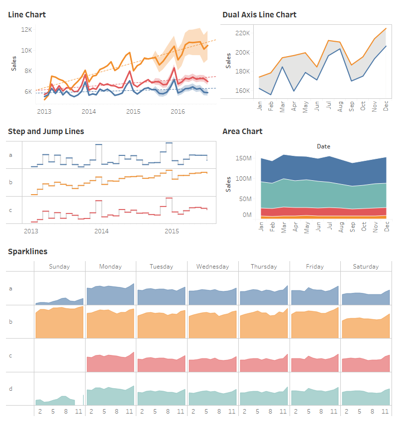
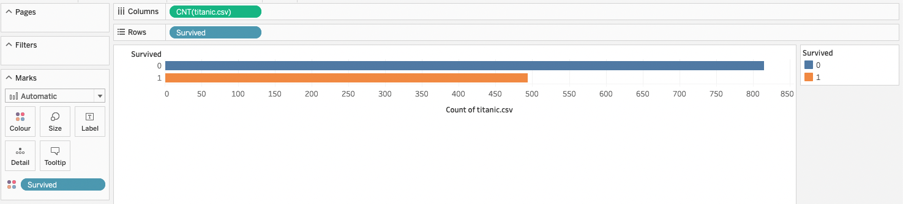
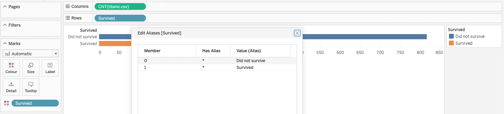
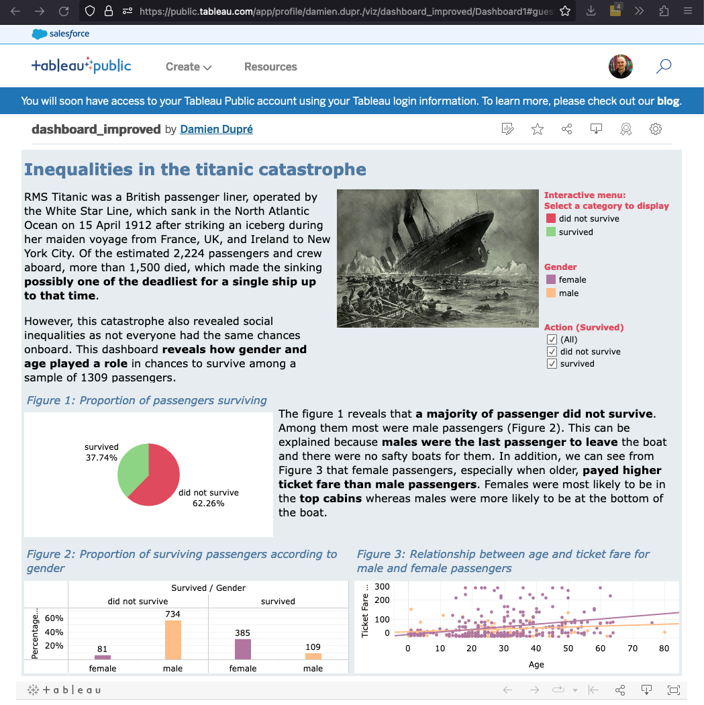

```{r setup, include=FALSE}
# libraries --------------------------------------------------------------------
library(anicon)
library(tidyverse)
library(knitr)

# options ----------------------------------------------------------------------
options(scipen = 999)
opts_chunk$set(message = FALSE, warning = FALSE, echo = FALSE, fig.retina = 3, fig.align = "center")
```

# Previoulsy ...

We have seen how to create clear and efficient figures:

- Pie Chart
- Bar Plot
- Density Plot
- Histogram Plot
- Dynamite Plot
- Scatterplot

Based on basic statistical calculations:
- Count
- Proportion
- Median/Quartiles
- Mean/Standard Deviation
- Correlation

---

# Design Strategy

Creating an prefect Tableau dashboard is easy if you follow these steps:

#### Step 1: Basic Figures

Create many figures that can be used to support your story but leave them with all default parameters

#### Step 2: Basic Dashboard

Use the most relevant figures in a basic dashboard without taking care of its design but including all the relevant elements (title, text, pictures)

#### Step 3: Figure Improvement

Go back to the worksheet each figure included in the dashboard and customise them: Colour, size, shapes, title, captions, axes, and interactions

#### Step 4: Dashboard Improvement

Go back to the dashboard and customise it: Background, colours, fonts, layout and actions

---

# Going Forward

In general, through the lecture we have seen variables:

- Made of character strings (usually interpreted as categorical but not always)
- Made of numbers (usually interpreted as continuous but not always)

But variables can be made of many more values. In Business Analytics are particularly important: Locations and Dates. **How to manipulate Location and Date type variables in Tableau?**

--

Tableau is particularly interesting because it creates interactive dashboards, **how to create smart Tableau dashboards by customising their interactivity?**

--

Tableau is not limited to data visualisations, some data transformations can also be done, let's see **why doing your transformations in Tableau and how?**

--

Finally, the export or publication of Tableau dashboard can be tricky, we will see **how to share your dashboard for the assignment and in general?**

---

class: inverse, mline, center, middle

# 1. Location and Date Types in Tableau

---

# Space and Time Variables

For the moment we were only interested in two variable types:

- Categorical (made of characters) also called "Dimension" in Tableau
- Continuous (made of numbers) also called "Measures" in Tableau

However, we have seen that sometimes...

- A Categorical variable needs to be converted to Continuous (e.g., Opinion scales)
- A Continuous variable needs to be converted to Categorical (e.g., Survived 0/1 in titanic)

> In Tableau change the type of a variable by drag-drop in the list of variables "Dimensions" or "Measures"

--

.pull-left[
In addition to Categorical and Continuous variables, Tableau has special features to handle **Location** type and **Date** type variable.
]
.pull-right[
```{r out.width='100%'}
include_graphics("https://yodalearning.com/wp-content/uploads/Tableau-Data-types.png")
```
]

---

# Location Type Variables

Is a list of geographical localisation by:
- Continents (Europe, Asia, Africa, Oceania, North America, South America)
- Country (Ireland, France, Spain, Germany, ...)
- States, Regions, Counties, Cities ... 

By default, location variables should be properly encoded. A blue globe icon should appear before the variable.

But if Locations are encoded as a Categorical (if made of characters) or Continuous variable (if made of numbers), you need to give this variable a **Geographic Role**

```{r out.width='40%'}
include_graphics("https://help.tableau.com/current/pro/desktop/en-us/Img/maps_getstarted6.gif")
```

---

# Mapping with Tableau

To create a data visualisation map:

1. Drag and drop the **location variable in the row/column** of the main worksheet
2. Use **Show Me** and select one of the Map type figure (Longitude/Latitude variables are automatically generated)
  - Symbol map (data reduced to a point - good for cities)
  - Maps (data fill the full shape of the location)
3. Drag and drop in the **Color box of Marks** another variable to display changes in values according to location for this variable

```{r out.width='60%'}
include_graphics("https://i0.wp.com/datadent.org/wp-content/uploads/2020/03/Map-change-colors.gif")
```

---

# Mapping with Tableau

More details about Tableau and maps with the following contents among others found online:

- [Get Started Mapping with Tableau by Tableau](https://help.tableau.com/current/pro/desktop/en-us/buildexamples_maps.htm)
- [Build a Simple Map by Tableau](https://help.tableau.com/current/pro/desktop/en-us/maps_howto_simple.htm)
- [Tableau Map by Vizual Intelligence](https://vizualintelligenceconsulting.com/blog-tableau-maps/)
- [Maps in Tableau by Tutorial Gateway](https://www.tutorialgateway.org/maps-in-tableau/)
- [Create A Map with Multiple Layers in Tableau by Anthony B. Smoak](https://www.youtube.com/watch?v=bwUj2NZHTC4)

```{r out.width='50%', fig.align='default'}
include_graphics("https://www.edureka.co/community/?qa=blob&qa_blobid=15134316276860426432")
include_graphics("https://static.packt-cdn.com/products/9781786465634/graphics/B05527_05_01.jpg")
```

---

# Date Type Variables

Is a variable referring to a specific time, it can be any combination and format including year, month, day, minute, second, ...

For example, "March 23, 1984", "03/23/84", "23/03/1984", "1984-03-23" have **different formats but refer to the date**.

In data science we use the ISO 8601 international standard format (%Y-%m-%d) which corresponds to "1984-03-23" (format allow to sort date easily)

By default, date variables should be properly encoded. A **blue calendar icon** should appear before the variable.

But if Dates are encoded as a Categorical (if made of characters) or Continuous variable (if made of numbers), you need to convert this variable as **Date** or as **Date & Time**

---

# Line and Area Charts

Date variables are usually used as **X axis** (Column Field in Tableau) to display the evolution of another variable according the time.

The resolution of the chart can be adjusted by clicking on the **+ symbol** before the Date variable

```{r out.width='80%'}
include_graphics("https://help.tableau.com/current/pro/desktop/en-us/Img/datefunctions3.png")
```

---

# Line and Area Charts

While the Date variable is in one field, drag and drop the other variable in the other field.

It uses a **statistical aggregation** for this second variable. By default it is the Sum (see SUM) but it can be changed to Count, Proportion, Median, Mean, ...

To add a **second line in the same plot** using the original Date variable:

1. Drag and drop this second variable in the row or column field next to the first one
2. Then, select `Dual Axis` to merge them

```{r out.width='60%'}
include_graphics("img/tableau_dual_axis.gif")
```

---

# Line and Area Charts

More details about Tableau and timeseries figures with the following contents among others found online:

.pull-left[
- [Tableau Date Functions and How to Use Them for Your Analysis by Data Crunch Corp](https://datacrunchcorp.com/tableau-date-functions/)
- [Date Functions by Tableau](https://help.tableau.com/current/pro/desktop/en-us/functions_functions_date.htm)
- [Building Line Charts by Tableau](https://help.tableau.com/current/pro/desktop/en-us/buildexamples_line.htm)
- [Tableau Playbook - Line Chart by Pluralsight](https://www.pluralsight.com/guides/tableau-playbook-line-chart)
]

.pull-right[
```{r out.width='100%'}

```
]

---
class: title-slide, middle

## Live Example: Covid-19 Data Sample

---

class: inverse, mline, center, middle

# 2. Interactive Customisations in Tableau

---
class: title-slide, middle

## Variable Alias

---

# Variable Alias

Aliasing a Variable is not an interactive feature per se but it is a simple tip that can be very useful.

Creating an Alias means renaming the categories displayed by a variable (but the original names are kept for the calculations).

```{r out.width='90%'}

```

```{r out.width='90%'}

```

.center[Figure without Alias (Top) versus figure with Alias (Bottom)]

---
class: title-slide, middle

## hover Tooltip

---

# Marks Card

The design of the **default visualisation is created automatically** according to what Tableau consider as the most relevant, but this choice **can be modified**:

.pull-left[
1. By manually selecting the type of Mark displayed
2. By manually selecting the design of Mark displayed (i.e., Color, Size, Label, Detail, and Tooltip)
  
`r faa("arrow-circle-right", animate="horizontal", speed="slow", color="blue")` Note: Each can be customised globally but they can also be customised according to the values of variables (already used or additional)
]

.pull-right[
```{r out.width='80%'}
include_graphics("https://help.tableau.com/current/pro/desktop/en-us/Img/build_manual_shelves_marks1.png")
```
]

---

# Tooltip Principle

.pull-left[
The tooltip is a series of information (numeric or graphic) that are displayed in a temporary box when the user's cursor goes over or clicks on a visualisation element.
]

.pull-right[
```{r out.width='80%'}
include_graphics("https://interworks.com/wp-content/uploads/sites/default/files/wp-content/uploads/2010/08/TTDefault.png")
```
]

It is used to precise actual numbers behind the figures and to tell a short story about what is currently seen.

.pull-left[
```{r out.width='100%'}
include_graphics("https://interworks.com/wp-content/uploads/sites/default/files/wp-content/uploads/2010/08/CondFormatMore.png")
```
]

.pull-right[
```{r out.width='100%'}
include_graphics("https://cdns.tblsft.com/sites/default/files/blog/vit-gif-for-blog_leave-for-work.gif")
```
]

---

# Tooltip Principle

By default, the tooltip display all the **variables included in Rows and Columns** of the figure.

By clicking on the tooltip option from the marks cards, it is possible to **modify how the information is displayed**.

**Variables between `<>` symbols** are changing values according to the cursor position.

.pull-left[
For example:
```
Sex:                  <Sex>
Survived:             <Survived>
Count of titanic.csv: <CNT(titanic.csv)>
```
]

.pull-right[
Will show:
```
Sex:                  female
Survived:             survived
Count of titanic.csv: 734
```
]

However,  we can reorganise how the information is displayed, which helps to tell a story.

For example:
```
After the catastrophe, <CNT(titanic.csv)> <Sex> passengers <Survived>!
```

Will show:
```
After the catastrophe, 734 female passengers survived!
```

---

# Tooltip Advanced

It is possible to **add more variables** in the tooltip with drag-and-drop to the marks card.

However, instead of adding another value, you can also **add a full visualisation** in the tooltip. When configuring the tooltip, click `Insert` and select `Sheets` with the name of the visualisation to add.

```{r out.width='100%'}
include_graphics("img/tableau_sheet_tooltip.gif")
```

---
class: title-slide, middle

## Filters and Highlighters

---

# Filters

You can display **only specific data** by using the "Filters Card" and selecting how to filter the data that are displayed (i.e., which categories for categorical variables and which values for continuous variables).

```{r out.width='100%'}
include_graphics("https://help.tableau.com/current/pro/desktop/en-us/Img/filtering-drag.gif")
```

---

# Filters

Filters also refers to addition of a **filtering menu** for the users to perform their own selection.

.pull-left[
To add a Filter menu to a visualisation:

1. Click `Analysis` from the top toolbar and click `Filters`
2. Select the variable that the user can choose values from
3. From the drop down arrow of the new filter menu, customise its design

`r faa("arrow-circle-right", animate="horizontal", speed="slow", color="blue")` Note: The same result can be achieved with the `Filters` card by selecting `Show Filter`.
]

.pull-right[
```{r out.width='100%'}
include_graphics("https://help.tableau.com/current/pro/desktop/en-us/Img/show_filter2.gif")
```
]

---

# Highlighters

Highlighters also add a **highlighters menu** for the users to focus the visualisations on some categories of data.

When added to a dashboard, the highlighters menu will apply to all visualisations involving the variable highlighted.

.pull-left[
To add a Filter menu to a visualisation:

1. Click `Analysis` from the top toolbar and click `Highlighters`
2. Select the variable that the user can highlight values from
3. From the drop down arrow of the new highlighter menu, customise its design but it is much more limited that the customisation of the filter menu
]

.pull-right[
```{r out.width='100%'}
include_graphics("https://cdnl.tblsft.com/sites/default/files/blog/third_highlighter.gif")
```
]

---
class: title-slide, middle

## Time Animation Player

---

# Time Animation Player

To visualise change according to time in a figure, a time variable can be added to the "Page Card".

The possibility to play the changes will be offered to the user from additional controls.

```{r out.width='80%'}
include_graphics("https://miro.medium.com/max/1400/1*9wAYT7RHcaZOCNs0suDcmg.gif")
```

---
class: title-slide, middle

## Actions

---

# Basic Actions

While Filters and Highlighters are set-up at each figure level, Actions are **set-up at the dashboard** level and affects all figures included in the dashboard.

.pull-left[
```{r out.width='100%'}
include_graphics("https://help.tableau.com/current/pro/desktop/en-us/Img/Actions_dialog.png")
```
]

.pull-right[
Click `Dashboard` from the top toolbar and click `Actions`. Then you have to choose:

1. How to trigger the action (when the cursor moves on a figure, when it clicks on a figure, from an added menu)
2. From which figure it comes from
3. Which figures it impacts
]

**Filter and Highlight actions are the easiest** to implement as they are behaving like Filters and Highlighters but for the full dashboard.

Some other actions can be trick to implement but could be essential when adding buttons for instance.

---

# Filter and Highlight Actions

If all the set-up fields are left as with default values, all the figure will be modified if a user hovers, clicks, or select a variable from a menu

.pull-left[
- Adding Highlight Actions to a dashboard is **the easiest way to make it smart**. By choosing "hover" as interaction mode, the figures will react to the users simultaneously.

- Filter Actions are interesting too but they can be **confusing when hover or click are chosen** to trigger. Prefer triggering Filter Actions from menus instead.
]

.pull-right[
```{r out.width='100%'}
include_graphics("https://interworks.com/wp-content/uploads/2019/02/GIF1.gif")
```
]

---

class: inverse, mline, center, middle

# 3. Data Transformation in Tableau

---

# Data Transformation in Tableau

If your data is a Stand Alone File, prefer transformations with MS Excel...

... Except for **pivoting your table** (long vs wide table) or **joining two or more tables**

If your data is an Auto Update document (type cloud hosted spreadsheet or database) then transforming in Tableau is required

Tableau has created a specific tool for data transformation called **Tableau Prep** but a lot can already be done with **Tableau Desktop**

```{r out.width='35%'}
include_graphics("https://memegenerator.net/img/instances/65548459/what-if-i-told-you-you-could-prep-your-data-for-tableau-in-minutes-not-hours.jpg")
```

---

# Pivot in Tableau

Pivot is the action to transform a table from wide (multiple variables) to long (one variable contains names and the second the values)

```{r out.width='80%'}
include_graphics("https://help.tableau.com/current/pro/desktop/en-us/Img/qs_pivot_example.png")
```

.pull-left[
In Data Source page:

1. Select the variables to pivot
2. Click left/double and use "Pivot"
]

.pull-right[
```{r out.width='80%'}
include_graphics("https://help.tableau.com/current/pro/desktop/en-us/Img/qs_pivot_command.png")
```
]

---

# Relationships vs Joins

The default method in Tableau is to use relationships. Relationships preserve the original tables’ level of detail when combining information. Relationships are the recommended method of combining data in most instances.

However, there may be times when you want to directly establish a join, either for control or for desired aspects of a join compared to a relationship, such as deliberate filtering or duplication.

.pull-left[
Join is the action of **merging two tables** based on a common key variable

1. Open a second table in Tableau's home page
2. In Data Source page, drag and drop this second table next to the first table 
]

.pull-right[
```{r out.width='90%'}
include_graphics("https://help.tableau.com/current/pro/desktop/en-gb/Img/data_model_single_tablewjoin2.gif")
include_graphics("https://help.tableau.com/current/pro/desktop/en-gb/Img/data_model_single_tablewjoin3.gif")
```
]

---

# Link to Data Transformation in Tableau

.pull-left[
### Pivot Tutorials

- [Pivot Data from Columns to Rows by Tableau](https://help.tableau.com/current/pro/desktop/en-us/pivot.htm)
- [How to Create Tableau Pivot by Data Flair](https://data-flair.training/blogs/pivot-in-tableau/)
- [Pivot in Tableau by EDUCBA](https://www.educba.com/pivot-in-tableau/)

### Join Tutorials

- [Join Your Data - Part 1 by Tableau](https://help.tableau.com/current/pro/desktop/en-gb/joining_tables.htm)
- [Join Your Data - Part 2 by Tableau](https://help.tableau.com/current/pro/desktop/en-us/joining_tables.htm)
- [Learn the rules to join tables in Tableau by Data Flair](https://data-flair.training/blogs/tableau-joins/)
- [Tableau - Data Joining by Tutorialspoint](https://www.tutorialspoint.com/tableau/tableau_data_joining.htm)
]

.pull-right[
```{r out.width='100%'}
include_graphics("http://www.quickmeme.com/img/c7/c702826a3aa55ac8a6f8cf52763a6205eec186242077b184bf162a1ccf3b30ce.jpg")
```
]

---
class: title-slide, middle

## Live Examples

---
class: inverse, mline, center, middle

# 4. Publish your Tableau Dashboard

---

# Publish 

#### Publishing is the process of saving a dashboard online. It can then be accessed by everyone.

`r faa("exclamation-triangle", animate="flash", speed="slow", color="red")` Warning: For your assignment, publish your dashboard online and submit the dashboard URL on loop.

```{r out.width='70%'}

```

---

# Export vs. Share with Desktop

More details about how to save and share Tableau Desktop with the following contents among others found online:

- [A Quick Guide to Tableau File Types](https://vizartpandey.com/a-quick-guide-to-tableau-file-types/)
- [Learn all kinds of file extensions used in Tableau](https://data-flair.training/blogs/tableau-file-types/)
- [TWB vs TWBX in Tableau](https://analyticscanvas.com/twb-vs-twbx-in-tableau/)
- [Understanding Tableau File Extensions](https://interworks.com/blog/rcurtis/2016/04/14/alphabet-soup-understanding-tableau-file-extensions/)

```{r out.width='60%'}
include_graphics("https://interworks.com/wp-content/uploads/sites/default/files/blog-content/TableauFileExtensions.png")
```

.center[Different types of Tableau export files. TWBX has to be used for the assignment because it includes the dashboard and the data (contrary to TWB files which only include dashboards)]

---
class: title-slide, middle

## Live Examples

---
class: inverse, mline, center, middle

# 5. Assignment 1 Brief

---

# Assignment Instructions

### Context

You are Data Analyst for the UNICEF organisation, an you have been asked to design a Tableau Dashboard to raise awareness of the public on a specific world issue.

### Task

Two data files will be emailed to you, focus your dashboard on the files called **unicef_indicator_1.csv** and **unicef_indicator_2.csv**. Use the file **unicef_metadata.csv** to help developing your story if you need to.

**Tell a "story" (i.e., narrative) behind the data in ONE Tableau Dashboard.**

.pull-left[
### Assessment Criteria

- Creativity (25%)
- Analytical Depth (25%)
- Beauty/Design (25%)
- Overall Story (25%)
]

.pull-right[
### Assessment Submission

Submit the URL of your dashboard on the Assignment Upload module of the MT5000 Loop page

**Deadline March 30th, 1pm**
]

---

# Tableau Challenge

`r faa("exclamation-triangle", animate="flash", speed="slow", color="red")` Warning: This is not mandatory for your assignment, only submitting the URL of your dashboard before March 30th on Loop is.

Tableau is much more than basic visualisations, very professional output can be obtained easily, see some examples online: https://public.tableau.com/gallery/

- Use these existing dashboards as inspirations for your own dashboards. Don't reinvent the wheel, reproducing with your own data is challenging enough. 
- Follow the steps of Mehmet, student of MT5000 in 2020 and Domitille in 2022, selected among the top 10 of [EDHEC DataViz Challenge](https://www.edhec.edu/en/edhec-dataviz-challenge)

### EDHEC DataViz Challenge (2023)

- Step 1: Publish your dashboard entry to your Tableau Public Profile with the tag **#StudentdataViz2023**.
- Setp 2: From March 7, submit your dasboard URL [here](https://docs.google.com/forms/d/e/1FAIpQLSfKDVRlQzM5GK5wLNTtdxxHkk3uyYnjW7_BjycxwC31qDMd_w/viewform).

### The Challenge is open for entries until April 11th, 2023. 

---

# Tableau Challenge

Past challenges are an excellent way to have an idea of outstanding dashboards:
- [Google Data Viz Challenge (2012)]( https://public.tableau.com/en-us/s/big-data-viz-challenge-entries)
- [Big Data Viz Challenge (2016)]( https://public.tableau.com/en-us/s/big-data-viz-challenge)
- [Do Good Data Viz Challenge (2016)](https://www.tableau.com/tableau-foundation-challenge)
- [Women in Analytics Data Viz Competition (2020)](https://womeninanalytics.com/data-viz-competition/)
- [DataConnect Data Viz Competition (2022)](https://www.dataconnectconf.com/dataviz-competition)

```{r out.width='30%'}
include_graphics("https://media.makeameme.org/created/use-tableau-you.jpg")
```

---
class: inverse, mline, left, middle


# Thanks for your attention and don't hesitate to ask if you have any question!

[`r fontawesome::fa(name = "twitter")` @damien_dupre](http://twitter.com/damien_dupre)  
[`r fontawesome::fa(name = "github")` @damien-dupre](http://github.com/damien-dupre)  
[`r fontawesome::fa(name = "link")` damien-datasci-blog.netlify.app](https://damien-datasci-blog.netlify.app)  
[`r fontawesome::fa(name = "paper-plane")` damien.dupre@dcu.ie](mailto:damien.dupre@dcu.ie)