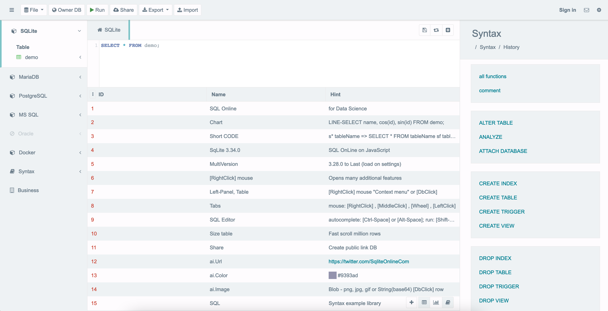
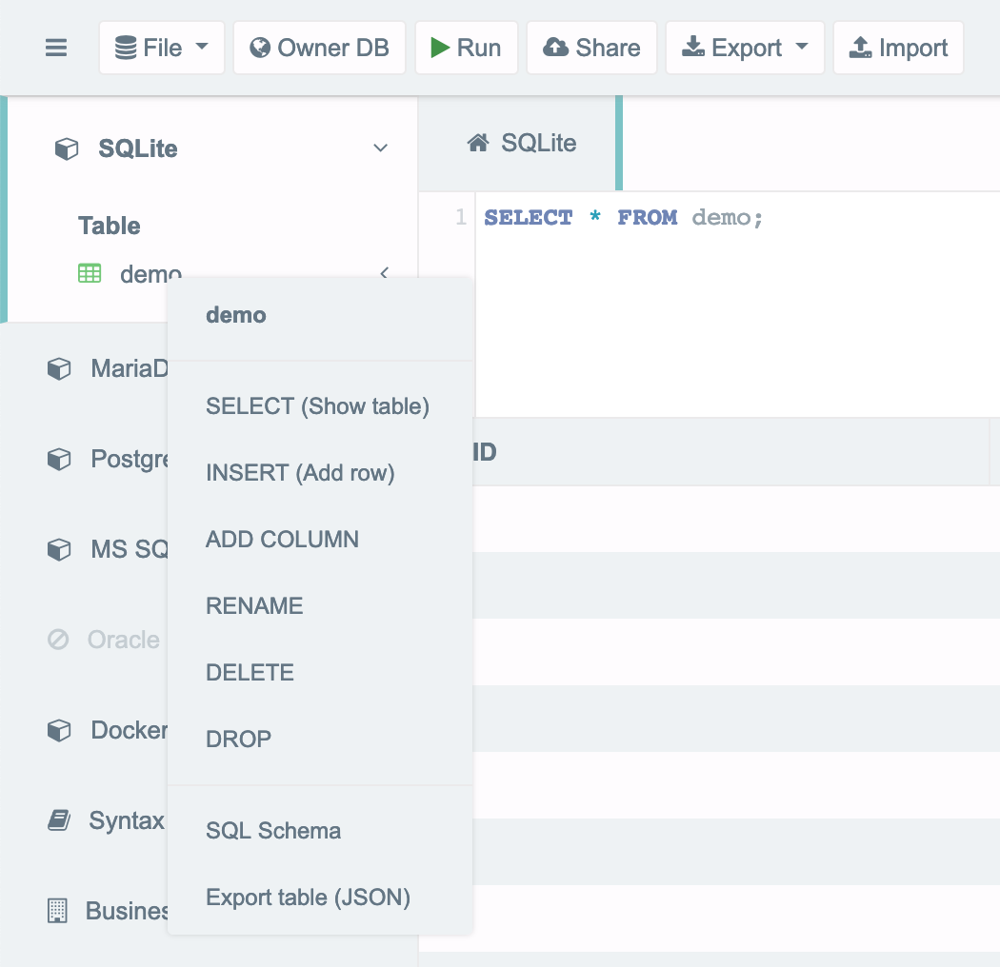
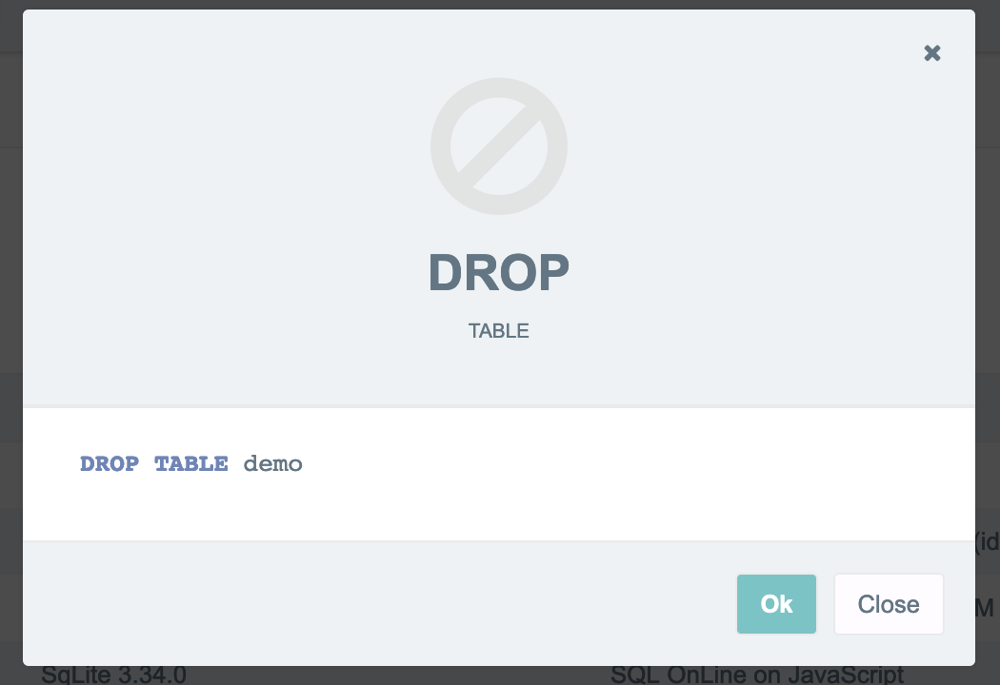
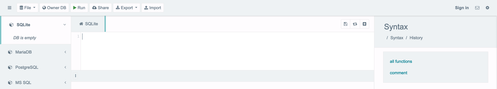
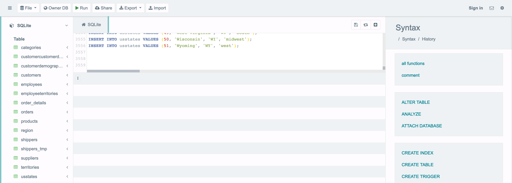
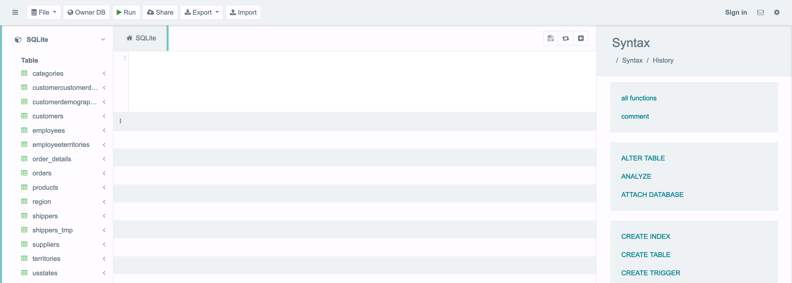

```{r setup, include = FALSE}
# general options --------------------------------------------------------------
options(scipen = 999)
set.seed(42)
# chunk options ----------------------------------------------------------------
knitr::opts_chunk$set(
  cache.extra = knitr::rand_seed, 
  message = FALSE, 
  warning = FALSE, 
  error = FALSE, 
  echo = FALSE,
  cache = FALSE,
  eval = TRUE,
  comment = "", 
  fig.align = "center", 
  fig.retina = 3
  )
# libraries --------------------------------------------------------------------
library(tidyverse)
library(knitr)
library(fontawesome)

# theme ------------------------------------------------------------------------
library(xaringanthemer)
style_mono_light(
  base_color = "#23395b",
  code_inline_background_color ="#23395b"
  )
```

# Objectives

All the game of this tutorial will be to create new tables that can be downloaded for our analyses.

With this tutotrial, test basic SQL queries and explore additional functions

```{r out.width='80%'}
include_graphics("img/board_database.png")
```

---
class: inverse, mline, center, middle

# 1. Configure the Database

---

# Configure the Database (1)

#### On the loop page of the module, download the document called “northwind_onlinedemo.txt” on your desktop.

```{r out.width='100%'}
include_graphics("img/tut_1_0.png")
```

---

# Configure the Database (2)

#### Open your web browser and go to https://sqliteonline.com/

```{r out.width='100%'}

```

---

# Configure the Database (3)

#### Click right (Win)/double (Mac) on demo, use DROP

```{r out.width='70%'}

```

---

# Configure the Database (3)

```{r out.width='50%'}

```

```{r out.width='100%'}

```

---

# Configure the Database (4)

#### Copy-Paste the text of the file “northwind_onlinedemo.txt” (3556 lines) and press Run on the top menu bar (you should see the 15 table appears on the left box).

```{r out.width='100%'}

```

---

# Configure the Database (5)

#### Select all the lines in the box (CTRL + A or Cmd + A) and delete them. 

The first line should be empty as displayed here below.

```{r out.width='100%'}

```

---
class: inverse, mline, center, middle

# 2. Test Basic Queries

---

# Run the Following Query (1)

Copy the two lines here bellow and paste them in the code box. Click RUN to process the code:

```{sql, eval=FALSE, echo=TRUE}
SELECT *
FROM customers;
```

You should obtain:
- **Give me the data of all the variable ...**
- **... from the table called "customers"**

```{r out.width='100%'}
include_graphics("img/tut_1_7.png")
```

---

# Run the Following Query (2)

Copy the two lines here bellow and paste them in the code box. Click RUN to process the code:

```{sql, eval=FALSE, echo=TRUE}
SELECT *
FROM customers
WHERE Country = "Mexico" OR Country = "Ireland";
```

Verify that you obtained:
- **Give me the data of all the variable ...**
- **... from the table called "customers"...**
- **... but only for customers which country is Mexico or Ireland**

---
class: inverse, mline, center, middle

# 3. Explore New Functions

---

# Create New Variables

While asking for a subset of the database with a SQL query, it is also possible to perform basic operations and to display their results in new variables

Instead of using a variable name, indicate the calculation for each observation and give it a variable name with **AS**

For example, RUN the following code:

```{sql, eval=FALSE, echo=TRUE}
SELECT ProductName, UnitsInStock * UnitPrice AS profit_max
FROM products;
```

Verify that you obtained:
- **Give me the data of ProductName and of UnitsInStock multiplied by UnitPrice which is now called profit_max ...**
- **... from the table called "products"**

---

# Summarise Data

A new variable could also includes a summary/aggregation of data

Several functions like COUNT, AVG, MAX, or MIN can be used in addition to GROUP 

For example, RUN the following code:

```{sql, eval=FALSE, echo=TRUE}
SELECT  COUNT (ContactName) AS count_contact, Country
FROM customers
GROUP BY Country;
```

Verify that you obtained:
- **Give me the data of a variable count_contact which counts the amount of contact and also their country ...**
- **... from the table called "customers"...**
- **... and count the amount of contact by country**

---

# Join Tables

Sometimes the information you need is spread accross two tables. Then, it is necessary to query the two tables in the same time.

JOIN allows to merge two table ON a key variable (included in both table)

5 different type of JOIN exists:
- LEFT keeps only the data from the first table
- RIGHT keeps only the data from the second table
- FULL keeps all the data from both first and second table
- INNER keeps only common data to both first and second table
- ANTI keeps data that are not common to both first and second table

For example, RUN the following code:

```{sql, eval=FALSE, echo=TRUE}
SELECT *
FROM  orders 
INNER JOIN customers ON orders.CustomerID =  customers.CustomerID;
```

---
class: inverse, mline, center, middle

# 4. Write Your Own Queries

---

# Translate to SQL Queries 

Query 1:
- **Give me the product names and prices ...**
- **... from the table products ...**
- **... but only for products which price is higher than $60 and lower than $120**

Query 2:
- **Give me the average price ...**
- **... from the table products ...**
- **... for each category of products**

Query 3:
- **Give me the cities ...**
- **... from the table customers ...**
- **... but only located in Ireland**

---

# Solutions

Query 1:

.pull-left[
```{sql, eval=FALSE, echo=TRUE}
SELECT ProductName, UnitPrice
FROM products
WHERE UnitPrice > 60 AND UnitPrice < 120;
```
]

.pull-right[
```{sql, eval=FALSE, echo=TRUE}
SELECT ProductName, UnitPrice
FROM products
WHERE UnitPrice BETWEEN 60 AND 120;
```
]


Query 2:
```{sql, eval=FALSE, echo=TRUE}
SELECT CategoryID, AVG(UnitPrice) AS average_price
FROM products
GROUP BY CategoryID;
```

Query 3:
```{sql, eval=FALSE, echo=TRUE}
SELECT City
FROM customers
WHERE Country = 'Ireland';
```

---
class: inverse, mline, left, middle


# Thanks for your attention, find me at...

[`r fa(name = "twitter")` @damien_dupre](http://twitter.com/damien_dupre)  
[`r fa(name = "github")` @damien-dupre](http://github.com/damien-dupre)  
[`r fa(name = "link")` damien-datasci-blog.netlify.app](https://damien-datasci-blog.netlify.app)  
[`r fa(name = "paper-plane")` damien.dupre@dcu.ie](mailto:damien.dupre@dcu.ie)