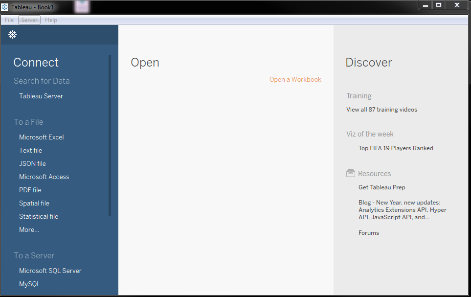
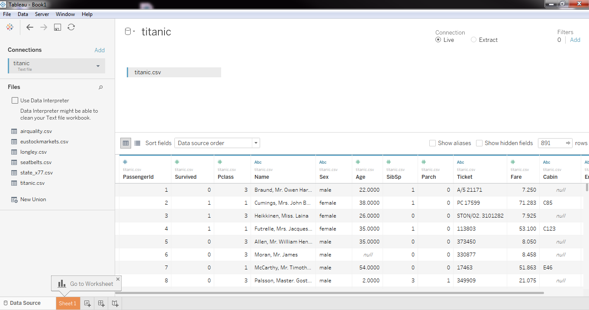
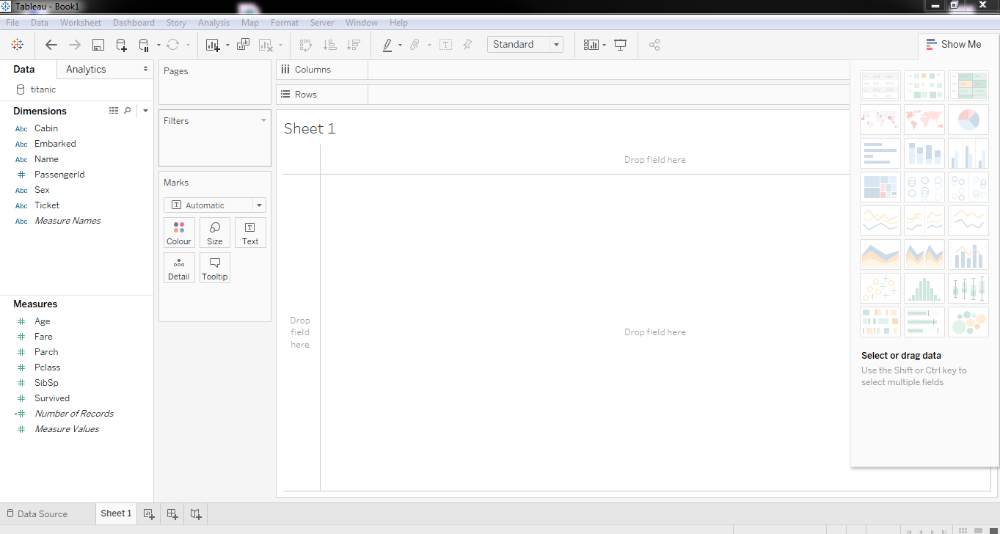
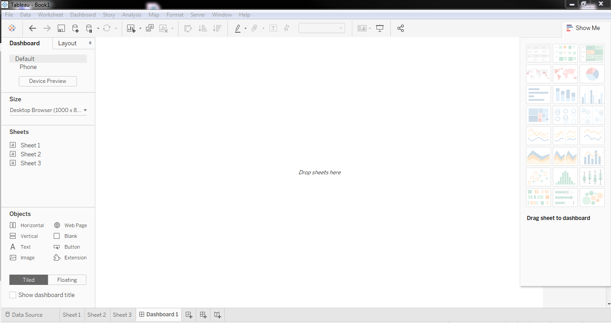
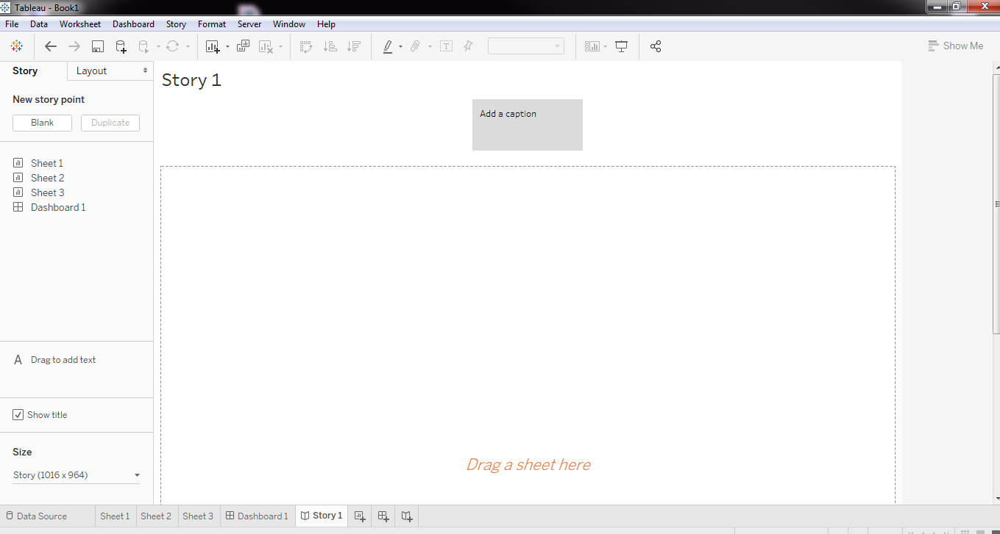
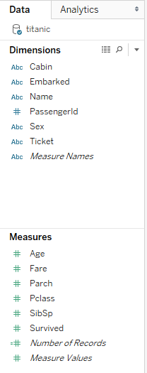
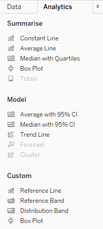
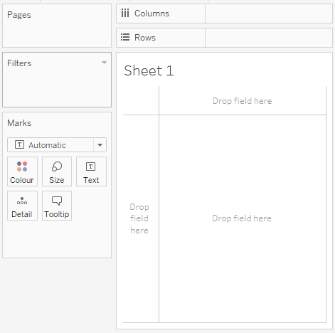
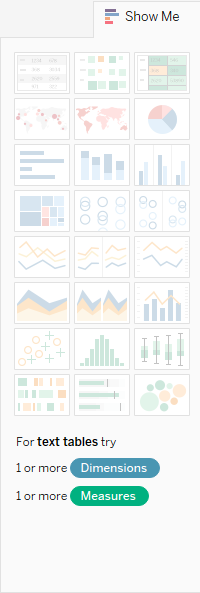
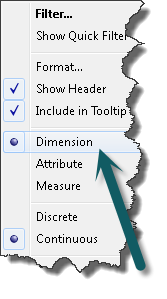

```{r setup, include = FALSE}
# general options --------------------------------------------------------------
options(scipen = 999)
set.seed(42)
# chunk options ----------------------------------------------------------------
knitr::opts_chunk$set(
  cache.extra = knitr::rand_seed, 
  message = FALSE, 
  warning = FALSE, 
  error = FALSE, 
  echo = FALSE,
  cache = FALSE,
  eval = TRUE,
  comment = "", 
  fig.align = "center", 
  fig.retina = 3
  )
# libraries --------------------------------------------------------------------
library(tidyverse)
library(knitr)
library(fontawesome)

# theme ------------------------------------------------------------------------
library(xaringanthemer)
style_mono_light(
  base_color = "#23395b",
  code_inline_background_color ="#23395b"
  )
```

# Objectives

This tutorial is about how create basic visualisations with TABLEAU

```{r out.width='80%'}
include_graphics("https://www.tableau.com/sites/default/files/2020-11/05-HP-Leader-460X300%402x.png")
```

---
class: inverse, mline, center, middle

# 1. Around Tableau

---

# What is Tableau?

Tableau is a set of different product which aims to create interactive data visualisation dashboard.

Among these product, you will find:

- **Tableau Prep** (dedicated to cleaning data - no use here)
- **Tableau Desktop** (the main software - not free but can be access with a student license)
- **Tableau Public** (exact same a Tableau Desktop but free and the only way to save your work is by publishing dashboard online)
- **Tableau Server & Tableau Online** (alternative to Tableau Desktop without local installation)

---

# How to Install Tableau Desktop?

If you have a Windows, MacOs (except M1), or Linux:

1. Go to https://www.tableau.com/products/desktop/download
2. Fill you DCU email address
3. Click Download Free Trial (A license will be provided to use it September)

```{r out.width='60%'}
include_graphics("https://data-flair.training/blogs/wp-content/uploads/sites/2/2019/11/enter-business-email-1.png")
```

Note: [Tableau is currently not supporting Rosetta 2, the OS running the new M1 chip (26 Jan 2021)](https://kb.tableau.com/articles/issue/Tableau-Mac-Software-Does-Not-Yet-Support-Apple-Silicon-CPU). Users of Apple Silicon CPU With M1 Chip will have to use Tableau Online to do their assignment.

---

# How to Install Tableau Desktop?

Once Tableau Desktop is downloaded, install it, then 

1. Click Activate 
2. On the form, enter your school email address for Business E-mail and enter the name of your school for Organization.
3. Activate with your product key that you have received by email (valid until September)

Already have a copy of Tableau Desktop installed? Update your license in the application: Help menu → Manage Product Keys

.center[
```{r out.width='40%', fig.align='default'}
include_graphics("https://d2h0cx97tjks2p.cloudfront.net/blogs/wp-content/uploads/sites/2/2019/11/activation-1.png")
include_graphics("https://d2h0cx97tjks2p.cloudfront.net/blogs/wp-content/uploads/sites/2/2019/11/registration-1.png")
```
]

---
class: inverse, mline, center, middle

# 2. Tableau Overview

---

# Tableau in a Nutshell

Very similar to Excel but focused only on visualisation

5 types of page:

- Start Page
- Data Source
- Worksheet
- Dashboard
- Story

---

# Tableau Start Page

```{r out.width='100%'}

```

---

# Tableau Data Source

```{r out.width='100%'}

```

---

# Tableau Worksheet

```{r out.width='100%'}

```

---

# Tableau Dashboard

```{r out.width='100%'}

```

---

# Tableau Story 

```{r out.width='100%'}

```

---

# Principles

Tableau is only about:
- Drag & drop from variable list to plot 
- Select the right data summary
- Create independent figure and organising them on a page

```{r out.width='40%'}
include_graphics("https://i.redd.it/31zkb6zzn8f21.jpg")
```

---
class: inverse, mline, center, middle

# 3. Understand the Worksheet

---

# Variable List Tab

.pull-left[
```{r out.width='50%'}

```
]

.pull-right[
Dimensions = Categorical Variables
- Made of character string (most of the time)
- Can be numeric if refers to an ID

Measures = Continuous Variables
- Made of numbers
- Special cases of **Number of Records** and **Measure Values**

]

---

# Analytics Tab

.pull-left[
```{r out.width='50%'}

```
]

.pull-right[
Special features behind the Data Tab
- Box Plot
- Median and Quartiles
- Average
- Regression Line (Trend Line)
]

---

# Plot Configuration

.pull-left[
```{r out.width='100%'}

```
]

.pull-right[
- Columns = X axis
- Rows = Y axis
- Pages = 1 plot per values (categories)
- Filters = Keep specific values
- Marks = Design of representation
  - Colors
  - Size
  - Texts
  - ...
]

---

# Show Me: Additional Design

.pull-left[
```{r out.width='50%'}

```
]

.pull-right[
- Tables
- Maps
- Histograms
- Pie charts
- Line charts
- Bar charts
- Scatterplots
- Box plots
- ...
]

---

# Aggregation Method

.pull-left[
- For Measures only (continuous variable)
- Possibilities:
  - Dimensions (raw data)
  - Measure
    - COUNT
    - AVERAGE
    - STD
    - ...
]

.pull-right[
```{r out.width='100%'}

```
]

---
class: inverse, mline, center, middle

# 4. Master the Key Figures

---

# The Dataset: "titanic.csv"

This data set provides information on the fate of the 1309 passengers on the fatal maiden voyage of the ocean liner ‘Titanic’ with their economic status (class), sex and age.

Description of the dataset: 
- **Survival:** Survival (0 = No, 1 = Yes) 
- **Pclass:** Ticket class (1 = 1st, 2 = 2nd, 3 = 3rd) 
- **Sex:** Male/Female
- **Age:** Years 
- **Sibsp:** # of siblings / spouses aboard the Titanic 
- **Parch:** # of parents / children aboard the Titanic 
- **Ticket:** Ticket number 
- **Fare:** Passenger fare 
- **Cabin:** Cabin number 
- **Embarked:** Port of Embarkation (C = Cherbourg, Q = Queenstown, S = Southampton) 

---

# Ex 1: Pie Chart

## Create a pie chart by counting the amount of passenger with the Survived variable


---

# Ex 2: Bar Chart

## Create a bar chart by counting the amount of passenger of with the Survived variable by Gender


---

# Ex 3: Proportions

## Create a bar chart or pie chart with the proportion of passenger from the Survived variable by Gender. 

--

Solution:

- Click on Analysis
- Percentage Of
- Select which of Table/ Row / Column / Pane is the most relevant for you

---

# Ex 4: Histogram 

## Create an histogram of the Fare variable

## Change the bin size by clicking on the new dimension called "Fare(bin)" and Edit size of bins.

---

# Ex 5: Box Plot

## Create a box plot of the Fare measure by clicking on the variable and selecting Dimension


---

# Ex 6: Histogram + Box Plot

## Create an histogram plot of the Fare measure by Survived variable

---

# Ex 7: Scatterplot 

## Create a scatterplot of Fare by Age and split using the Survived variable

---
class: inverse, mline, left, middle


# Thanks for your attention!